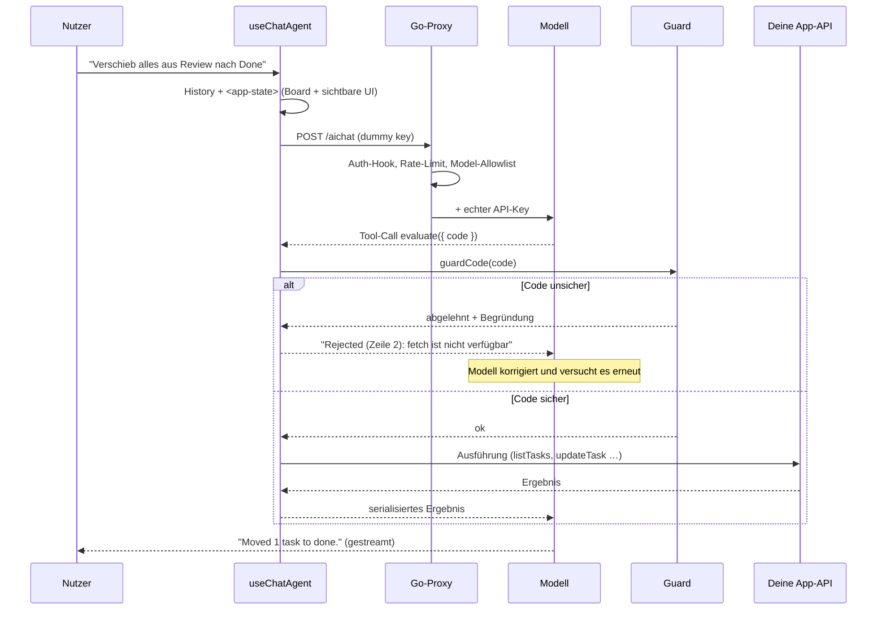
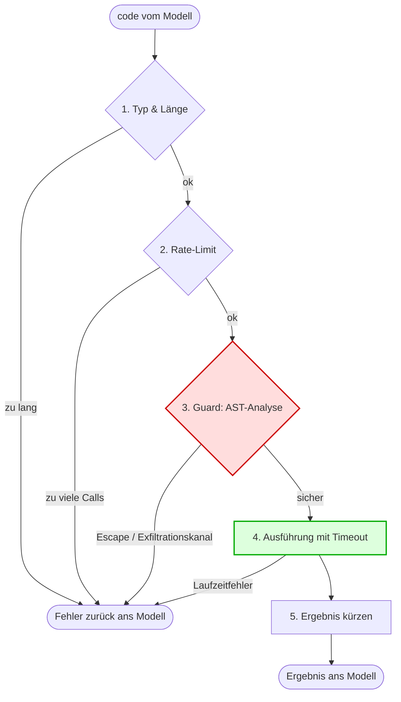
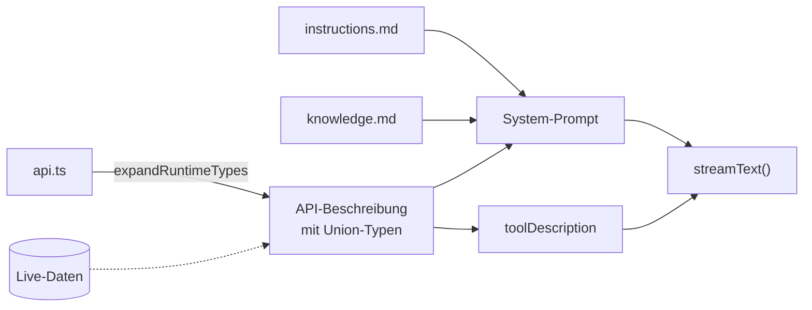

# baseaichat

Ein wiederverwendbarer Chat-Agent für bestehende **Go-Backend / React-Frontend**-Anwendungen.
Der Agent beantwortet nicht nur Fragen — er **liest den Zustand der App und bedient sie**, wie
ein zweiter Nutzer, der neben dir sitzt.

Gedacht als Baustein, den man in mehrere Apps einhängt (z. B. FieldDraft): Backend rein als
`http.Handler`, Frontend als React-Komponente. Was pro App neu entsteht, sind drei Dateien —
API, API-Beschreibung, Instructions.

***

## Features auf einen Blick

| Feature                         | Was es bedeutet                                                                                                                   |
| ------------------------------- | --------------------------------------------------------------------------------------------------------------------------------- |
| **evaluate-Pattern**            | Ein einziges Tool statt 20 Tool-Schemas. Das Modell schreibt JavaScript gegen deine API — mit Schleifen, Filtern, Aggregation.    |
| **AST-Guard**                   | Jeder generierte Code wird vor der Ausführung statisch geprüft — Sandbox-Escapes und Exfiltrationskanäle fliegen raus, bevor ein Statement läuft.  |
| **Skript-Guard**                | Der Agent darf Skripte für die Skriptsprache der App schreiben (TypeScript, Klassen) — mit denselben Blocklisten.                  |
| **UI-Awareness**                | Der Agent sieht die sichtbare Oberfläche (`data-*`-Attribute) und kann Buttons klicken, Felder füllen, Optionen wählen.           |
| **Runtime-Types**               | Die API-Beschreibung wird vor jedem Turn mit echten Werten angereichert: `status: string` → `status: "todo" \| "done"`.           |
| **Token-Streaming**             | Antworten erscheinen Token für Token; Tool-Calls werden live sichtbar.                                                            |
| **Auditierbare Tool-Aktivität** | Jeder ausgeführte Code steht aufklappbar im Chat. Der Nutzer sieht, warum sich seine App verändert hat.                           |
| **Multi-Provider**              | Google, OpenAI, Anthropic, OpenRouter. Der Wechsel ist ein Config-Wert.                                                           |
| **Gehärteter Proxy**            | API-Key serverseitig, Model-Allowlist, Rate-Limit, Auth-Hook, Body-Limit, Path-Traversal-Schutz, SSE-Flushing.                    |
| **Vision**                      | Screenshots anhängen; bei Bildern wird automatisch auf das Vision-Modell umgeschaltet.                                            |
| **Prompt-Caching**              | Der stabile Teil des Prompts (Instructions + API) wird vom Provider gecacht.                                                      |

## Technologie-Stack

| Schicht       | Technologie                                                         |
| ------------- | ------------------------------------------------------------------- |
| Backend       | Go (nur Stdlib, keine Dependencies)                                 |
| Frontend      | React 18/19, TypeScript                                             |
| LLM-Anbindung | Vercel AI SDK v6 (`ai`, `@ai-sdk/*`, `@openrouter/ai-sdk-provider`) |
| Code-Analyse  | acorn (+ acorn-typescript für den Skript-Guard)                     |
| Rendering     | marked + DOMPurify                                                  |
| Tests         | `go test`, Vitest (+ jsdom)                                         |

***

## Schnellstart

```bash
# 1. Proxy starten – er hält den API-Key
cd server
AI_PROVIDER=openrouter AI_API_KEY=sk-or-… AI_PROXY_ADDR=:8090 go run ./cmd/aichat-proxy

# 2. Demo-App starten (Vite proxyt /aichat → :8090)
cd example
npm install && npm run dev      # → http://localhost:5180
```

Die Demo ist ein Sprint-Board. Probier:

* „Wie viel Arbeit ist noch offen?" → er liest das Board und rechnet
* „Weis die unzugewiesenen Todos ada zu" → er ändert mehrere Tasks in einem Aufruf
* „Zeig mir nur die erledigten" → er bedient den Filter in der Oberfläche

**Node:** Vite 7 braucht Node ≥ 20. Falls das System-Node älter ist: `source ~/.nvm/nvm.sh && nvm use 22`.

***

## Architektur

```
Browser                                          Server                Provider
┌──────────────────────────────────────┐        ┌────────────┐       ┌──────────┐
│ ChatPanel                            │        │            │       │          │
│   └─ useChatAgent   ─────────────────┼───────▶│  aichat    │──────▶│ Gemini / │
│        │  (Agent-Loop, Streaming)    │  kein  │  .Proxy    │ + Key │ Claude / │
│        ▼                             │  Key   │  (Go)      │       │ GPT      │
│      evaluate-Tool                   │        └────────────┘       └──────────┘
│        ├─ guard   (AST-Prüfung)      │              │
│        └─ Ausführung ────────────────┼──────────▶ Deine App-API + DOM
└──────────────────────────────────────┘
```

**Der Agent-Loop läuft im Browser.** Das ist die zentrale Entscheidung. Wenn das Modell Code
ausführt, läuft dieser Code dort, wo der Zustand liegt: synchron am Store, am echten DOM, am
3D-Renderer. Ein serverseitiger Agent müsste für jeden Lesezugriff und jeden Klick einen Kanal
zurück zum Client öffnen.

Der Go-Teil ist bewusst **kein intelligentes AI-Backend**, sondern ein Pass-Through mit
Leitplanken: Key injizieren, prüfen, weiterreichen, streamen. Kein State, keine Queue, keine
Datenbank — horizontal skalierbar und in jeden bestehenden Go-Server einbettbar.

### Ablauf eines Turns



Bis zu `maxSteps` (Default 20) solcher Runden pro Nachricht. Fehler gehen als Text zurück ans
Modell — es liest sie, korrigiert seinen Code und versucht es erneut. Genau dafür ist ein
Tool-Loop da.

### Dateiübersicht

| Pfad                               | Inhalt                                                                                           |
| ---------------------------------- | ------------------------------------------------------------------------------------------------ |
| `server/proxy.go`                  | Der Handler: Auth-Hook, Rate-Limit, Body-Limit, Model-Allowlist, Traversal-Schutz, SSE-Streaming |
| `server/providers.go`              | Provider-Registry (Base-URL, Auth-Stil, wo das Modell im Request steht)                          |
| `server/ratelimit.go`              | Fixed-Window-Limiter pro Client                                                                  |
| `server/cmd/aichat-proxy/`         | Standalone-Binary für die lokale Entwicklung                                                     |
| `web/src/core/guard.ts`            | AST-Prüfung des generierten Codes: Escapes und Exfiltrationskanäle, scope-bewusst               |
| `web/src/core/evaluator.ts`        | Der Executor mit den 5 Schichten                                                                 |
| `web/src/core/runtimeTypes.ts`     | `@values`-Annotationen → konkrete Union-Typen                                                    |
| `web/src/core/roundValues.ts`      | Zahlen runden, bevor sie ins Kontextfenster wandern                                              |
| `web/src/browser/uiState.ts`       | `readUIState()` — DOM lesen                                                                      |
| `web/src/browser/uiActions.ts`     | `createUIActions()` — DOM bedienen                                                               |
| `web/src/react/useChatAgent.ts`    | Der Agent-Loop                                                                                   |
| `web/src/react/chatSession.ts`     | Konversation außerhalb von React                                                                 |
| `web/src/react/ChatPanel.tsx`      | Fertige Chat-UI                                                                                  |
| `web/src/providers/createModel.ts` | Provider-Factory                                                                                 |
| `example/`                         | Sprint-Board-Demo, die alles zusammen zeigt                                                      |

***

## Das evaluate-Pattern

### Warum ein Tool statt zwanzig

Der klassische Weg: pro Aktion ein Tool, jedes mit eigenem JSON-Schema, Input-Parsing,
Output-Formatting. Hier gibt es **ein** Tool — `evaluate` — das JavaScript gegen eine
beschriebene API ausführt.

**1. Weniger Tokens.** Zwanzig Tool-Definitionen reisen in *jedem* Request mit. Eine
API-Beschreibung im System-Prompt reist einmal und wird danach vom Provider gecacht.

**2. Das Modell kann programmieren, nicht nur aufrufen.** „Verschieb jede zweite Aufgabe nach
Review" ist mit Einzel-Tools nicht ausdrückbar — man bräuchte ein Batch-Meta-Tool oder ein
Dutzend Roundtrips. Als Code ist es eine Schleife:

```js
const tasks = listTasks();
for (let i = 1; i < tasks.length; i += 2) {
  updateTask(tasks[i].id, { status: "review" });
}
return { moved: Math.floor(tasks.length / 2) };
```

**3. Weniger Arbeit für dich.** Du pflegst eine Datei — die API-Beschreibung. Sie ist
gleichzeitig echtes TypeScript (der Compiler prüft sie), Dokumentation für das Modell, und die
Basis für die Runtime-Types. Kein Zod-Schema pro Funktion, kein Parser, kein Formatter.

| Ansatz                   | Was du pro Aktion schreibst                                                  |
| ------------------------ | ---------------------------------------------------------------------------- |
| Klassisches Tool-Calling | Tool-Definition + Schema + Input-Parsing + Output-Formatting + Registrierung |
| **evaluate**             | Eine Methode im API-Objekt + eine Zeile in der Beschreibung                  |

**4. Ein Tool-Call statt vieler.** Lesen, filtern, ändern und zusammenfassen passiert in einem
Aufruf — nicht in acht.

Der Preis: Du führst modellgenerierten Code aus. Deshalb der Guard.

### createEvaluator() — Konfiguration

```ts
// Die Annotation ist nicht Kosmetik: sie bindet die Implementierung an die
// Beschreibung, die das Modell liest. Siehe „Die Beschreibung ist ein Vertrag“.
const api: AgentApi = {
  listTasks: () => board.list(),   // was der Agent darf
  addTask: board.add,
  highlightElement: ui.highlightElement,   // click, fill, select, highlight
  readUIState,                     // was er sieht
  // …
};

const evaluate = createEvaluator({
  api,
  onAfterRun: () => store.notify(),          // Re-Render, Undo-Eintrag …
  onBeforeRun: (code) => console.debug(code),
  transformResult: (r) => roundValues(r, 2), // Ergebnis aufräumen

  maxCodeLength: 10_000,      // ① Input-Prüfung
  maxCallsPerWindow: 40,      // ② Rate-Limit
  rateWindowMs: 60_000,
  timeoutMs: 30_000,          // ④ Timeout
  maxResultLength: 50_000,    // ⑤ Ergebnis kürzen
  extraBlocked: ["APP"],      // ③ eigene Globale zusätzlich sperren
});
```

### Sicherheitsmodell — 5 Schichten



Der Code läuft in `with (api) { … }`. Das ist **Ergonomie, keine Sicherheit**: `with` macht die
API-Funktionen ohne Präfix aufrufbar — aber jeder Bezeichner, den `api` *nicht* kennt, fällt
durch auf den echten globalen Scope. Schicht 3 fängt die Konstrukte ab, mit denen man das
ausnutzen würde.

Wichtig: Ein abgelehnter Code wird **nie teilweise ausgeführt**. Die Prüfung passiert vor dem
ersten Statement.

### Der Guard im Detail

`guard.ts` parst den Code mit acorn und prüft den AST gegen drei Blocklisten. Er **kennt deine
API nicht** — und muss sie nicht kennen: Er beschränkt *Sprachkonstrukte*, nicht das Vokabular
deiner Anwendung.

Zwei Einstiegspunkte, dieselben Regeln:

| | Für | Besonderheit |
| --- | --- | --- |
| `guardCode(source)` | den Code des `evaluate`-Tools | JavaScript, `this` verboten |
| `guardScript(source)` | Skripte, die der Agent für deine Skript-Umgebung schreibt | TypeScript, Klassen und `this` erlaubt — [siehe unten](#skripte-die-der-agent-schreibt--guardscript) |

| Liste | Was sie blockiert | Beispiele |
| --- | --- | --- |
| **Knotentypen** | Konstrukte, die den Scope umgehen | `this` (→ `globalThis`), `import()`, `import.meta`, `with`, Tagged Templates, `debugger` |
| **Bezeichner** | Namen, die aus der App hinausführen | `eval`, `Function`, `arguments`, `Proxy`, `Reflect`, `window`, `document`, `location`, `navigator`, `fetch`, `XMLHttpRequest`, `WebSocket`, `Image`, `Worker`, `open`, `localStorage`, `setTimeout`, `alert`, `require`, … |
| **Properties** | Zugriffe entlang der Prototype-Chain | `.constructor`, `.prototype`, `.__proto__`, `getPrototypeOf`, `__defineGetter__`, … |

#### Warum Blocklist und nicht Allowlist

Die naheliegende Alternative wäre eine Allowlist: Jeder Bezeichner muss sich gegen die Keys des
API-Objekts plus ein paar Built-ins auflösen lassen, alles andere fliegt raus. Das ist strenger
— **unbekannte Globale scheitern dann geschlossen** — aber es setzt voraus, dass der Guard die
Namen der API kennt. In einer echten Anwendung kennt er sie nicht:

* Die API ist ein **tiefer Objektbaum** (`kernel.model.features[i].params`), keine flache
  Funktionsliste.
* Sie entsteht **zur Laufzeit**, wächst während der Session oder liegt hinter Gettern und
  Proxies — `Object.keys(api)` ist in dem Moment unvollständig, in dem man es aufruft.

Eine Allowlist, die die echte Fläche nicht kennt, lehnt **legitime Aufrufe** ab. Und ein Guard,
der die eigene API der App blockiert, ist schlimmer als nutzlos: Das Modell kommt nicht weiter,
und der Reflex des Entwicklers ist, den Guard aufzuweichen.

Deshalb beschränkt der Guard die Sprache und nicht das Vokabular — und die Sicherheitsgrenze
rückt dorthin, wo sie ohnehin hingehört: **an das API-Objekt.** Siehe „Grenzen".

#### Ein geblockter Name meint nur den *Globalen* dieses Namens

`open`, `parent`, `top`, `self` sind ganz normale Variablennamen. Der Guard verfolgt deshalb die
lexikalischen Scopes (`const`/`let`/`var`, Parameter, Destructuring, Hoisting, `catch`) und
schlägt nur bei **freien** Referenzen an:

```js
const open = listTasks().filter((t) => !t.done);   // ✅ lokale Variable, kein window.open
const parent = node.parent;                        // ✅
return task.location;                              // ✅ Property, kein globales location
return open;                                       // ❌ frei → der echte Globale
```

Ohne diese Unterscheidung würde der Guard alltäglichen Code ablehnen — genau der Fehlermodus, der
dazu führt, dass man einen Guard am Ende abschaltet.

#### Computed Access

```js
tasks[0];                       // ✅ numerisches Literal
tasks[i];                       // ✅ einfacher Identifier (i wird separat geprüft)
task["title"];                  // ✅ erlaubtes String-Literal
task["constructor"];            // ❌ blockiertes String-Literal
task["constr" + "uctor"];       // ❌ zusammengesetzter Ausdruck
task[keys[j]];                  // ❌ Ausdruck als Key
task[fn()];                     // ❌ Funktionsaufruf als Key
```

Ein Key, der erst zur Laufzeit entsteht, kann alles buchstabieren — also ist nur erlaubt, was
sich statisch lesen lässt. Braucht das Modell wirklich einen dynamischen Lookup über einen
Objektbaum, gib ihm dafür eine API-Funktion (`getProperty(obj, name)`), die den Namen prüft.

#### Fehlermeldungen sind für das Modell geschrieben

```
Rejected (Zeile 3, Spalte 12): "fetch" is not allowed. Use only the documented
API functions and plain JavaScript.
```

Diese Meldung geht zurück ans Modell. Es liest sie, schreibt den Code um und versucht es erneut
— ohne dass der Nutzer etwas davon merkt.

#### Anpassen

```ts
createEvaluator({
  api,
  extraBlocked: ["APP", "KERNEL"],   // eigene Globale zusätzlich sperren
  allowBlocked: ["setTimeout"],      // im Ausnahmefall wieder freigeben
});
```

#### Testabdeckung

`guard.test.ts` deckt legitime Muster ab, die das Modell tatsächlich schreibt (Schleifen,
Destructuring, async, tiefe und dynamische API-Bäume), dazu Sandbox-Escapes, jeden
Exfiltrationskanal, Obfuscation, Scope-Shadowing und die Limits. Zusammen mit Evaluator,
Runtime-Types und UI-Helfern: **81 Unit-Tests**, plus 11 Proxy-Tests auf Go-Seite.

### Skripte, die der Agent schreibt — `guardScript()`

Hat deine App eine Skriptsprache, willst du früher oder später, dass der Agent sie *schreibt* —
nicht nur die API bedient. Dieser Quelltext ist typischerweise TypeScript mit Klassen, und
`guardCode()` würde ihn komplett ablehnen: Es parst reines JavaScript und blockt `this`.

`guardScript()` ist derselbe Guard für diesen Fall: **TypeScript-Parsing, Klassen und `this`
erlaubt — dieselben Blocklisten.** Kein `window`, kein `fetch`, kein `eval`, kein
`import()`.

```ts
import { guardScript } from "baseaichat";

const verdict = guardScript(source, {
  allowImportsFrom: ["@myapp/script-std"],   // alles andere: kein import
  extraBlocked: ["__appStore", "__kernel"],  // eigene Debug-Globals versiegeln
});

if (!verdict.ok) {
  // Geht zurück ans Modell – es korrigiert und schickt neu.
  return `Rejected${verdict.at ? ` (Zeile ${verdict.at.line})` : ""}: ${verdict.reason}`;
}
await runInScriptRuntime(source);
```

**Eine Bedingung, und sie ist nicht verhandelbar: Der Host muss das Skript im _strict mode_
ausführen** — als ES-Modul oder hinter einem `"use strict"`-Prolog. Im sloppy mode bindet ein
gewöhnlicher Funktionsaufruf `this` an `globalThis`, und `this.fetch(...)` spaziert an der
gesamten Blocklist vorbei. Ohne strict mode ist `guardScript` wertlos.

Zwei Eigenschaften, auf die du dich verlassen kannst:

* **Typen sind keine Referenzen.** `function f(target: Document)` ist erlaubt — der Typ wird
  wegkompiliert. `const d = document` im Wertkontext bleibt verboten. Getestet gegen die Stellen,
  an denen sich Code in TypeScript verstecken lässt: Parameter-Properties, Enum-Initializer,
  Decorator, Static-Blocks, `as`, `!`, berechnete Klassen-Keys.
* **Was der Parser nicht lesen kann, wird abgelehnt** — nie ungeprüft durchgewunken. Konkret:
  `acorn-typescript` kennt den `satisfies`-Operator nicht; solche Skripte scheitern mit einem
  Syntaxfehler. Eine Falschablehnung, kein Loch.

Und die ehrliche Einordnung: Der Guard beschränkt das **Vokabular** des Skripts, nicht die
**Macht deiner Skript-Laufzeit**. Was deine Skriptumgebung darf, darf auch das Skript des
Agenten. Das ist ein bewusst eingegangenes Risiko — zeig dem Nutzer das Skript, bevor es läuft,
und lass es ihn bestätigen.

### Grenzen — was der Guard *nicht* leistet

Sei hier ehrlich mit dir selbst, sonst baust du auf einer Illusion:

* **Eine Blocklist ist konstruktionsbedingt unvollständig.** Jeder Globale, an den niemand
  gedacht hat, ist erreichbar. Der Guard ist eine belastbare Barriere gegen ein Modell, das
  entgleist — **keine Sandbox, die einen Angreifer einsperrt.**
* **Die API ist die eigentliche Sicherheitsgrenze.** Der Guard hält den Code davon ab, aus der
  API *auszubrechen*. Was die API *darf*, entscheidest du.
  **Nimm nichts hinein, was du dem Nutzer nicht auch selbst erlauben würdest.** Destruktives
  (Löschen, Bezahlen, Versenden) gehört hinter eine Rückfrage — und `onAfterRun` an einen
  Undo-Checkpoint, damit ein missratener Turn ein Ctrl+Z ist.
* **Jeder andere Ausführungspfad in deiner App führt am Guard vorbei.** Hat deine Anwendung eine
  Skriptsprache, ein Plugin-System oder sonst irgendetwas, das Code ausführt, und darf das Modell
  darauf schreiben, dann ist der Guard dort erst zuständig, wenn du ihn hinschickst: siehe
  `guardScript()`. Und selbst dann beschränkt er nur das Vokabular des Skripts — nicht das, was
  deine Skript-Laufzeit kann.
* **Endlosschleifen frieren den Tab ein.** Der Code teilt sich den Main-Thread mit der App (er
  braucht synchronen Zugriff auf Store und DOM). Der Timeout greift nur bei asynchronen Hängern —
  `while (true) {}` läuft im selben Thread wie der Timer.

***

## System-Prompt & Wissensbasis

Der Prompt wird aus Teilen zusammengesetzt und als `systemPrompt: string[]` übergeben:

| Baustein                  | Inhalt                                                             | Zweck                        |
| ------------------------- | ------------------------------------------------------------------ | ---------------------------- |
| `instructions.md`         | Rolle, Regeln, wann handeln statt fragen, wie mit Fehlern umgehen  | Verhalten                    |
| `api.ts` (per `?raw`)     | TypeScript-Signaturen mit JSDoc, `@values`-Annotationen, Beispiele | Was das Modell aufrufen kann |
| `knowledge.md` (optional) | FAQ, Domänenwissen, Glossar                                        | Fakten                       |

Dieselbe API-Beschreibung geht zusätzlich als `toolDescription` an das evaluate-Tool.

### Die Beschreibung ist ein Vertrag

> **Die Beschreibung ist keine Dokumentation, sie ist eine Spezifikation.**
>
> Das Modell kann nur benutzen, was dort steht — und es benutzt *exakt* das. Eine erfundene
> Signatur in dieser Datei ist deshalb kein Stilfehler, sondern ein Bug. Und ein besonders
> tückischer: Er äußert sich als *Modellfehler*. Das Modell kopiert deine falsche Signatur
> gehorsam, der Code scheitert, und du suchst den Fehler beim LLM statt in deiner Datei.
>
> In der FieldDraft-Integration ist genau das passiert: eine Signatur, die es so nie gab.

Dagegen hilft kein Vorsatz, sondern nur der Compiler. `api.ts` deklariert deshalb ein
**Interface**, und die Implementierung wird per Typannotation daran gebunden:

```ts
// agent/api.ts — was das Modell liest
// @api-start
interface AgentApi {
  /** Adds a task. Defaults: status "todo", assignee "unassigned", estimate 1. */
  addTask(input: { title: string; status?: Status; estimate?: number }): Task;
  removeTask(id: number): { removed: number };
  // …
}
// @api-end

// Unterhalb des Markers: der Compiler sieht das, das Modell nie.
export type { AgentApi };
```

```ts
// agent/setup.ts — was der Agent erreicht
const api: AgentApi = {
  addTask: board.add,
  removeTask: board.remove,
  // …
};
```

Damit kann die Beschreibung nicht mehr lügen. `tsc` fängt **alle drei** Drift-Richtungen:

| Drift                                            | Fehler                                                     |
| ------------------------------------------------ | ---------------------------------------------------------- |
| Beschrieben, aber nicht implementiert            | `TS2741: Property 'archiveTask' is missing … in 'AgentApi'` |
| Implementiert, aber nicht beschrieben            | `TS2353: 'deleteTask' does not exist in type 'AgentApi'`    |
| Beschrieben mit falscher Signatur                | `TS2322: Type 'string' is not assignable to type 'number'`  |

Die zweite Zeile ist der Grund, **die API-Funktionen einzeln aufzuzählen statt sie
hineinzuspreaden**: `...createUIActions()` rutscht an der Excess-Property-Prüfung vorbei, und
dann steht eine unbeschriebene Funktion im Scope des Modells, von der die Beschreibung nichts
weiß.

> **Was der Vertrag *nicht* prüft: die Beispiele.** Die stehen in `api.ts` in Kommentaren, der
> Compiler sieht sie nicht. Für sie gilt weiterhin von Hand: **kopier sie aus echtem, laufendem
> Code — schreib sie nicht aus dem Kopf.**



### Runtime-Types (`@values`)

Statische Typen zwingen das Modell zum Raten — und es rät falsch. Deshalb wird die Beschreibung
vor jedem Turn mit den Werten angereichert, die es **jetzt gerade** gibt.

**Was du schreibst:**

```ts
// @values context.assignees
type Assignee = string;
```

**Was das Modell sieht:**

```ts
type Assignee =
  | "ada"
  | "grace"
  | "linus"
  | "unassigned";
```

**Wiring:**

```ts
const beschreibung = expandRuntimeTypes(apiSource, {
  assignees: team.map((m) => m.name),   // beliebige Live-Daten
  statuses: STATUSES,
});
```

Unterstützt Type-Aliase (`type X = string;`) und Interface-Properties (`prop: string;`). Mit
`// @api-start` / `// @api-end` lässt sich zusätzlich der Ausschnitt markieren, den das Modell
sehen soll — Imports und Interna bleiben draußen.

**Das ist kein Kosmetik-Feature.** Im End-to-End-Test filterte das Modell ohne die Union mit
`!t.assignee` — und traf nichts, weil `"unassigned"` ein *Wert* ist und kein leeres Feld. Es
meldete trotzdem Vollzug. Mit der Union schrieb es `t.assignee === "unassigned"` und lag richtig.
Falsche Annahmen über gültige Werte sind die häufigste Fehlerquelle beim Tool-Calling —
Runtime-Types nehmen sie an der Wurzel weg.

### Prompt-Caching

Der System-Prompt (Instructions + volle API-Beschreibung) ist der mit Abstand größte, aber auch
der stabilste Teil jedes Requests. Deshalb:

* **Anthropic** braucht eine explizite Annotation — `useChatAgent` setzt sie automatisch
  (`cacheControl: { type: "ephemeral" }`).
* **Google / OpenAI** cachen identische Prompt-Präfixe automatisch serverseitig.

Deshalb hängt der App-Zustand (`appContext`) an der **User-Nachricht** und nicht am
System-Prompt: Er ändert sich jeden Turn und würde den Cache sonst bei jeder Nachricht
invalidieren.

### Warum kein RAG?

Die Wissensbasis wird komplett mitgeschickt, statt per Vektorsuche Chunks nachzuladen. Das ist
eine bewusste Entscheidung:

**1. RAG ist ein eigener Infrastruktur-Stack.** Embedding-Modell, Vektor-DB, Chunking-Strategie,
Indexing, Retrieval, Re-Ranking, Prompt-Assembly. Jede Stufe kann Fehler einführen, alle wollen
gepflegt und betrieben werden. Für die Wissensbasis einer einzelnen App ist das massiv
überdimensioniert.

**2. Embeddings verwischen bei Nuancen.** Ähnlichkeit ist nicht Relevanz. Die Antwort auf eine
Frage steht oft in mehreren Dokumenten gleichzeitig — Top-K liefert davon eine willkürliche
Auswahl.

**3. Zusammenhänge über Chunk-Grenzen gehen verloren.** Wenn die Regel in den Instructions
steht, die Ausnahme in der FAQ und die Begriffsdefinition im Glossar, muss das Modell alle drei
gleichzeitig sehen. Ein Retriever müsste das *wissen* — er tut es selten zuverlässig.

**4. Die Kontextfenster sind gewachsen.** RAG entstand, als Modelle 4.000–8.000 Tokens fassten.
Aktuelle Spitzenmodelle liegen bei Hunderttausenden bis Millionen. Die Wissensbasis einer
typischen App (Instructions, API-Typen, FAQ, UI-Zustand) ist ein Bruchteil davon.

**5. Prompt-Caching macht den vollen Kontext bezahlbar.** Das historische Hauptargument für RAG
war Kosteneffizienz. Mit Caching zahlst du den großen Prompt praktisch nur beim ersten Turn.

**6. Determinismus.** Voller Kontext heißt: gleiche Frage, gleiche Grundlage. Bei RAG hängt die
Antwortqualität am Retrieval-Ergebnis, und das schwankt mit der Formulierung der Frage. Das
macht Verhalten schwer testbar.

**Wann RAG trotzdem richtig ist:** Wissensbasis deutlich jenseits von \~100k Tokens (Support-
Portal mit zehntausenden Artikeln), sehr häufig wechselnde Datenmengen, oder Multi-Tenant mit je
eigener großer Wissensbasis pro Mandant.

***

## UI-Awareness

Drei Bausteine greifen ineinander.

### 1. App-Zustand bei jedem Request

Jede Nutzernachricht wird um einen `<app-state>`-Block ergänzt:

```ts
appContext: () =>
  JSON.stringify({
    tasks: board.list(),   // dein Domänenzustand
    ui: readUIState(),     // was gerade auf dem Schirm ist
  });
```

Damit muss das Modell nicht fragen, was der Nutzer sieht — es weiß es.

### 2. `readUIState()` — die Oberfläche lesen

Du annotierst die Elemente, die der Agent kennen darf. Alles andere bleibt für ihn unsichtbar —
das ist eine bewusste Kuratierung, kein DOM-Dump.

| Attribut          | Semantik                                                  |
| ----------------- | --------------------------------------------------------- |
| `data-group-key`  | Container / Gruppe — verschachtelt alles darin            |
| `data-button-key` | klickbarer Button                                         |
| `data-input-key`  | Texteingabe — der aktuelle Wert wird mitgelesen           |
| `data-select-key` | Auswahl — aktueller Wert (`data-value`) plus die Optionen |
| `data-info-key`   | Nur-Lese-Text                                             |

**Dein JSX:**

```tsx
<section data-group-key="filters">
  <select data-select-key="filter-status" data-value={filter}>
    <option value="all">all</option>
    <option value="done">done</option>
  </select>
  <span data-info-key="board-summary">5 tasks · 11.5 days</span>
  <button data-button-key="add-task">Add task</button>
</section>
```

**Was das Modell sieht:**

```json
{
  "uiElements": [
    {
      "group": "filters",
      "children": [
        { "select": "filter-status", "value": "all", "options": ["all", "done"] },
        { "info": "board-summary", "text": "5 tasks · 11.5 days" },
        { "button": "add-task" }
      ]
    }
  ]
}
```

Die Elemente erscheinen in **Dokumentreihenfolge** — das Modell liest die Oberfläche so, wie ein
Mensch sie liest. Unsichtbares (`display: none`, `visibility: hidden`, `opacity: 0`, inklusive
vererbt von Vorfahren) wird gefiltert: Was der Nutzer nicht sieht, darf der Agent nicht anklicken.

```ts
readUIState({
  root: document.querySelector("main")!,  // z. B. das Chat-Panel selbst ausschließen
  withPositions: false,                    // Bildschirmkoordinaten mitliefern
  context: () => ({ page: "board" }),      // eigene Fakten dazumischen
});
```

### 3. `createUIActions()` — die Oberfläche bedienen

| Funktion                    | Was sie tut                                                                            |
| --------------------------- | -------------------------------------------------------------------------------------- |
| `highlightElement(key)`     | scrollt hin und lässt das Element aufblitzen — zeigt dem Nutzer, wovon der Agent redet |
| `clickElement(key)`         | klickt den Button mit diesem `data-button-key`                                         |
| `selectOption(key, option)` | wählt eine Option (Radio-Gruppe oder `<select>`)                                       |
| `fillInput(key, value)`     | tippt in das Feld                                                                      |

Diese Funktionen wandern ins API-Objekt und sind damit für den generierten Code aufrufbar.

Zwei Details, die den Unterschied machen:

* **Sie bedienen die echten Controls**, nicht den Store dahinter. Validierung, Seiteneffekte und
  Undo-Historie der App laufen exakt wie bei einem menschlichen Klick — die Änderungen des Agenten
  sind von denen des Nutzers nicht zu unterscheiden.
* **`fillInput` schreibt über den Prototype-Setter** und feuert native Events. React installiert
  einen eigenen `value`-Setter und merkt sich den zuletzt geschriebenen Wert; eine direkte
  Zuweisung würde den DOM ändern, React aber im Glauben lassen, es habe sich nichts getan — das
  Change-Event verpufft und die Komponente rendert nie neu.

Keys vom Modell landen **nie** in einem CSS-Selektor: gesucht wird über das nackte Attribut und
verglichen wird in JavaScript. Damit gibt es keinen Selektor, aus dem man ausbrechen könnte.
Dazu ein Rate-Limit (Default 60 Aktionen/Minute) gegen einen durchdrehenden Agenten.

```ts
const ui = createUIActions({
  highlightClass: "ai-highlight",   // dein CSS
  highlightMs: 4000,
  maxActionsPerWindow: 60,
  onAction: (action, key) => analytics.track(action, key),
});
```

***

## Komponenten

### `useChatAgent` — der Hook

```ts
const { messages, busy, error, send, cancel, clear, session } = useChatAgent({
  provider: "google",                    // google | openai | anthropic | openrouter
  model: "gemini-3-flash-preview",
  visionModel: "gemini-3-flash-preview", // bei Bildern automatisch aktiv
  proxyUrl: "/aichat",

  systemPrompt: [instructions, apiBeschreibung],
  toolDescription: apiBeschreibung,
  evaluate,                              // aus createEvaluator()
  appContext: () => JSON.stringify({ state: store.list(), ui: readUIState() }),

  maxSteps: 20,
  session: meineSession,                 // optional, sonst eine pro Hook
  headers: { "X-Workspace": id },        // optional
  appTitle: "Sprint Board",              // wird als X-Title gesendet
  onError: (e) => reportError(e),
});
```

**Streaming.** Antworten kommen Token für Token (`streamText`), Tool-Calls erscheinen sofort als
eigene Nachricht mit Code und Ergebnis.

**Options-Identität ist egal.** Die Optionen dürfen bei jedem Render ein frisches Objektliteral
sein — der Hook liest sie über eine Ref, `send` bleibt stabil.

**Fehler landen beim Modell, nicht beim Nutzer.** Ein Fehler aus dem evaluate-Tool geht als Text
zurück in den Loop; das Modell korrigiert. Nur Transport- und Modellfehler werden als Banner
angezeigt.

### `ChatSession` — Konversation außerhalb von React

```ts
const session = createChatSession();     // einmal anlegen, an useChatAgent übergeben
session.getState();                      // { messages, status, error }
session.subscribe(listener);
session.reset();
```

In einer SPA wird das Chat-Panel bei Routenwechseln unmounted. Die Session liegt außerhalb von
React und überlebt das — auch während ein Request läuft. Sie ist ein **explizites Objekt** und
kein Modul-Singleton: Zwei Chats auf einer Seite (oder parallele Tests) bekommen je eine eigene
und können sich nicht gegenseitig ins Gehege kommen.

### `ChatPanel` — die fertige UI

```tsx
<ChatPanel
  agent={agentOptions()}
  title="Board assistant"
  launcherLabel="Ask the board"
  greeting="Ich kann das Board lesen und ändern."
  placeholder="Frag mich etwas…"
  suggestions={[
    { label: "Wie viel Arbeit ist offen?" },
    { label: "Nur erledigte zeigen", prompt: "Filtere das Board auf done" },
  ]}
  defaultOpen={false}
  allowImages={true}
  showToolActivity={true}
  defaultSize={{ width: 420, height: 560 }}
  headerExtra={<ModelPicker />}   // eigener Slot im Header, siehe unten
/>
```

`headerExtra` rendert einen beliebigen Knoten im Header, zwischen Titel und den Action-Buttons —
gedacht für Host-Steuerung wie einen Modell-Umschalter. Das Panel besitzt nichts daran: Inhalt,
Verhalten und Aussehen liegen bei dir. Der Slot rückt per `margin-left: auto` an die Action-Buttons
heran, der Titel bleibt links. Die Modellwahl selbst liegt ohnehin auf deiner Seite (`agentOptions()`
baut den Agent neu, sobald sich `model` ändert), das Panel liefert nur den Platz.

Launcher-Button, resizables Panel, Markdown (marked + DOMPurify), Bild-Anhänge, Abbrechen,
Verlauf löschen, Typing-Indikator, Streaming-Cursor — und die **aufklappbare Tool-Aktivität**:
jeder ausgeführte Code samt Ergebnis, fehlgeschlagene Calls rot markiert. Ohne das säße der
Nutzer vor einer UI, die sich ohne erkennbaren Grund verändert.

Modellausgabe ist unvertrauenswürdiger Text: Sie wird als Markdown gerendert und mit DOMPurify
sanitisiert, damit eine per Prompt-Injection eingeschleuste Antwort kein Script und keinen
`javascript:`-Link im DOM der Host-App platzieren kann.

**Styling** läuft komplett über CSS-Variablen (`--bac-surface`, `--bac-accent`, `--bac-radius`, …)
und folgt per `prefers-color-scheme` dem Systemthema. Überschreib die Variablen auf `:root` — kein
Fork nötig. Passt die Komponente gar nicht ins Produkt: `useChatAgent` direkt nehmen und eigene UI
bauen.

### `createModel` — Multi-Provider

| Provider       | Package                       | Auth                              | Besonderheit                                                                                                                                            |
| -------------- | ----------------------------- | --------------------------------- | ------------------------------------------------------------------------------------------------------------------------------------------------------- |
| **Google**     | `@ai-sdk/google`              | Query-Param `?key=`               | Nativer Provider nötig: Gemini-Thinking-Modelle brauchen `thought_signature` über mehrere Tool-Schritte. Der OpenAI-kompatible Endpunkt kann das nicht. |
| **OpenAI**     | `@ai-sdk/openai`              | Bearer                            | `.chat()` erzwingt Chat-Completions statt Responses-API — nur das sprechen kompatible Gateways.                                                         |
| **Anthropic**  | `@ai-sdk/anthropic`           | `x-api-key` + `anthropic-version` | Explizites Prompt-Caching.                                                                                                                              |
| **OpenRouter** | `@openrouter/ai-sdk-provider` | Bearer                            | Hunderte Modelle; `X-Title` + `HTTP-Referer` fürs Ranking.                                                                                              |

Der Wechsel ist ein Config-Wert. Ein neuer Provider ist ein `case`-Block plus ein Eintrag in der
Go-Registry.

***

## Der Go-Proxy

### Einbetten in einen bestehenden Server

```go
proxy, err := aichat.NewProxy(aichat.Config{
    Provider:      "google",
    APIKey:        os.Getenv("AI_API_KEY"),
    AllowedModels: []string{"gemini-3-flash-preview"},
    RateLimit:     60,
    Authorize:     func(r *http.Request) error { return session.Check(r) },
    ClientKey:     func(r *http.Request) string { return session.UserID(r) },
})
if err != nil {
    log.Fatal(err)
}
mux.Handle("/aichat/", http.StripPrefix("/aichat", proxy))
```

### Config-Referenz

| Feld                       | Default             | Wofür                                                |
| -------------------------- | ------------------- | ---------------------------------------------------- |
| `Provider`                 | —                   | `google`, `openai`, `anthropic`, `openrouter`        |
| `APIKey`                   | —                   | wird serverseitig injiziert; **Pflicht**             |
| `BaseURL`                  | Provider-Default    | eigenes Gateway; nötig bei unbekanntem Provider      |
| `Providers`                | eingebaute Registry | eigene Provider ergänzen/überschreiben               |
| `AllowedModels`            | leer \= alles       | Liste, Suffix `*` als Wildcard (`google/*`)          |
| `MaxBodyBytes`             | 4 MiB               | Chat-Historien mit Bildern werden groß               |
| `Timeout`                  | 5 min               | lange Tool-Turns mit Reasoning-Modellen sind legitim |
| `RateLimit` / `RateWindow` | 0 (aus) / 1 min     | Requests pro Client und Fenster                      |
| `ClientKey`                | Remote-IP           | in Apps mit Login besser die User-ID                 |
| `TrustForwardedFor`        | `false`             | nur hinter einem eigenen Reverse-Proxy einschalten   |
| `Authorize`                | nil (offen)         | Hook; `ErrUnauthorized` → 401, sonst 403             |
| `Logger`                   | `slog.Default()`    |                                                      |
| `Client`                   | eigener mit Timeout | z. B. für Custom-Transport                           |

### Was der Proxy prüft — und warum

* **Model-Allowlist.** Ohne sie kann der Client dein teuerstes Modell wählen — der Request kommt
  ja aus dem Browser. Bei Google steht das Modell im Pfad, bei den anderen im JSON-Body; der Proxy
  liest beides. **Ein POST, dessen Modell sich nicht bestimmen lässt, wird abgelehnt**, sobald eine
  Allowlist gesetzt ist — sonst könnte man sie umgehen, indem man das Modell woanders versteckt.
  Geprüft wird nur POST, denn dort findet Inferenz statt; GET ist Metadaten. Deshalb kannst du dir
  die Modellliste durch deinen eigenen Proxy ziehen, auch mit gesetzter Allowlist:

  ```bash
  curl -s -H 'X-Target-Path: models' http://localhost:8090/aichat/models \
    | jq '.data[] | select(.supported_parameters | index("tools")) | {id, pricing}'
  ```
* **Auth-Hook.** Läuft vor allem anderen. Ohne ihn ist der Proxy für jeden offen, der ihn erreicht.
* **Rate-Limit.** Fixed Window pro Client-Key, alte Buckets werden weggeräumt. `X-Forwarded-For`
  wird nur bei `TrustForwardedFor` beachtet — sonst könnte jeder Client das Limit durch einen
  gefälschten Header umgehen.
* **Body-Limit.** 413 statt einer OOM.
* **Path-Traversal.** Der Zielpfad kommt aus dem Header `X-Target-Path`. Enthält er `..`, wird
  abgelehnt — nicht stillschweigend normalisiert. Absolute URLs (`http://…`, `//host`) ebenfalls:
  der Proxy darf nur zu seinem eigenen Upstream sprechen.
* **Header-Hygiene.** Hop-by-hop-Header und die *vom Client gesendeten* `Authorization` /
  `x-api-key` werden verworfen (die SDKs bestehen auf einem Dummy-Key). `X-Title` und
  `HTTP-Referer` gehen durch — daran hängt OpenRouters Attribution.
* **SSE-Flushing.** Die Antwort wird chunkweise geschrieben **und geflusht**. Ohne das puffert
  Go die Ausgabe, und das Streaming kommt am Ende als ein Klumpen an — der Chat wirkt eingefroren.

### Auth-Stile

| Provider           | Stil                                 |
| ------------------ | ------------------------------------ |
| Google             | `?key=…` als Query-Parameter         |
| OpenAI, OpenRouter | `Authorization: Bearer …`            |
| Anthropic          | `x-api-key: …` + `anthropic-version` |

Query-Parameter des Clients werden weitergereicht (Google braucht `alt=sse`).

### Standalone-Binary (für die Entwicklung)

```bash
AI_PROVIDER=openrouter AI_API_KEY=sk-or-… go run ./cmd/aichat-proxy
```

| Env                 | Default   |                                                   |
| ------------------- | --------- | ------------------------------------------------- |
| `AI_PROVIDER`       | `google`  |                                                   |
| `AI_API_KEY`        | —         | Pflicht                                           |
| `AI_BASE_URL`       | —         | eigenes Gateway                                   |
| `AI_ALLOWED_MODELS` | leer      | kommagetrennt, `*` als Wildcard                   |
| `AI_RATE_LIMIT`     | 60        | Requests/Minute                                   |
| `AI_PROXY_ADDR`     | `:8090`   |                                                   |
| `AI_PROXY_PATH`     | `/aichat` |                                                   |
| `AI_CORS_ORIGIN`    | leer      | nur nötig, wenn Frontend auf anderer Origin läuft |

In Produktion bettest du stattdessen `aichat.NewProxy` in deinen eigenen Server ein — dann greift
die Session-Auth der App, und CORS entfällt, weil alles same-origin ist.

### CSRF

`useChatAgent` liest `<meta name="csrf-token">` und sendet den Wert als `X-CSRF-Token`; Cookies
gehen per `credentials: "include"` mit. Die **Validierung gehört in deinen `Authorize`-Hook** —
der Standalone-Proxy prüft nichts, er kennt deine Session ja nicht.

***

## Integration in eigene Anwendungen

### Die Lib wird als **Quelltext** eingebunden — und das hat eine Falle

Es gibt kein gebautes Bundle: Du zeigst mit einem Alias auf `web/src/index.ts`. Solange die Lib
*neben* deinem App-Paket liegt (wie `example/` hier neben `web/`), funktioniert das ohne
Zutun. **Sobald sie woanders liegt — etwa als Git-Submodule unter `third_party/` — bricht die
Modulauflösung**, und zwar vollständig:

Node und Vite lösen Bare-Imports **relativ zur importierenden Datei** auf. Die Imports *in
meinem Quelltext* (`react`, `ai`, `acorn`, `marked`, `dompurify`, `@ai-sdk/*`) suchen also ab
`third_party/baseaichat/web/src/` aufwärts — und laufen an `deineApp/web/node_modules` **vorbei**.
Kein einziger Import löst sich auf, weder im Dev-Server noch im Build noch in den Tests.
`resolve.dedupe` hilft dagegen nicht: Das greift erst, wenn überhaupt etwas aufgelöst wurde.

Zwei Wege raus:

**A — Alias-Map (robust, in FieldDraft im Einsatz).** Bilde jeden Bare-Specifier der Lib auf
*deine* `node_modules` ab und teile die Map zwischen Vite und Vitest:

```ts
// web/aichatResolve.ts
const pkgs = ["react", "react-dom", "ai", "acorn", "marked", "dompurify",
              "@ai-sdk/anthropic", "@ai-sdk/google", "@ai-sdk/openai",
              "@openrouter/ai-sdk-provider"];

export const aichatAlias = [
  { find: "baseaichat", replacement: resolve(__dirname, "../third_party/baseaichat/web/src/index.ts") },
  // Exakter Anker: ein simpler "react"-Prefix würde sonst auch "react-dom" schlucken.
  ...pkgs.map((name) => ({
    find: new RegExp(`^${name}(/.*)?$`),   // Subpfade wie react/jsx-runtime mitnehmen
    replacement: resolve(__dirname, "node_modules", name) + "$1",
  })),
];
```

Diese Map löst zur *Laufzeit* auf — Vite und Vitest. **`tsc` hat davon nichts** und braucht sein
eigenes `paths` in der `tsconfig.json`. Und genau dort steht die fieseste Falle des ganzen
Verfahrens:

> **Spiegle die Alias-Map nicht eins zu eins nach `paths`.** Für `tsc` zeigt
> `"react": ["./node_modules/react"]` auf den **JavaScript**-Runtime-Eintrag des Pakets — und
> schneidet damit `@types/react` ab. Jedes `import React` degradiert zu implizitem `any`, und
> zwar **auch in den Dateien der Lib**. Der Fehler erscheint also in fremdem Code, während die
> Ursache in deiner eigenen Config steht. Zeig für die Typen auf `@types/*`:
>
> ```jsonc
> "paths": {
>   "baseaichat": ["./third_party/baseaichat/web/src/index.ts"],
>   "react": ["./node_modules/@types/react"],          // nicht ./node_modules/react
>   "react-dom": ["./node_modules/@types/react-dom"]
> }
> ```

Hat man das einmal richtig, löst `tsc` `"baseaichat"` auf den **echten Quellcode** auf — und dann
braucht man auch keine handgeschriebene `baseaichat.d.ts` mehr. Eine solche Deklarationsdatei ist
dasselbe Anti-Muster wie eine unverbundene API-Beschreibung, nur eine Ebene höher: eine
Behauptung über fremden Code, die niemand prüft. In FieldDraft war sie falsch — `UIActions` war
dort als `Record<string, (...args: never[]) => unknown>` deklariert, so lose, dass eine Bindung an
eine Funktion, *die es gar nicht gibt*, anstandslos durchging. Genau die Drift, gegen die der
Vertrag antritt, kam durch die Hintertür wieder herein. Lösch die Datei, statt sie zu korrigieren.

**B — Deps im Lib-Verzeichnis installieren** (`cd third_party/baseaichat/web && npm install`) und
`resolve.dedupe: ["react", "react-dom"]` setzen, damit React einfach bleibt. Schneller
eingerichtet, kostet einen zweiten `node_modules`-Baum und lädt zur Versionsdrift ein.

### Wiederverwendbarkeits-Matrix

**✅ Unverändert übernehmen** — keine Domänenlogik:

| Datei                                           |                                                        |
| ----------------------------------------------- | ------------------------------------------------------ |
| `core/guard.ts`                                 | AST-Guard. Universell.                                 |
| `core/evaluator.ts`                             | Executor mit 5 Schichten. Nimmt jede API entgegen.     |
| `core/runtimeTypes.ts`                          | `@values`-Auflösung. Funktioniert mit jedem Interface. |
| `core/roundValues.ts`                           | Hilfsfunktion.                                         |
| `browser/uiState.ts`, `browser/uiActions.ts`    | DOM lesen/bedienen über `data-*`. Universell.          |
| `react/useChatAgent.ts`, `react/chatSession.ts` | Agent-Loop und State. Rein konfigurationsgetrieben.    |
| `providers/createModel.ts`                      | Provider-Factory.                                      |
| `server/*.go`                                   | Proxy. Konfiguration über `Config`.                    |

**⚙️ Anpassen** — Struktur bleibt:

| Datei                          | Was du änderst                                                 |
| ------------------------------ | -------------------------------------------------------------- |
| `react/ChatPanel.tsx` / `.css` | Texte, Farben, Icons, Layout — meist reichen die CSS-Variablen |
| `cmd/aichat-proxy/main.go`     | Vorlage für das Einbetten in deinen eigenen Server             |

**🔧 Neu schreiben** — das ist *dein* Assistent:

| Datei                     | Was sie tut                                                   | Vorlage                             |
| ------------------------- | ------------------------------------------------------------- | ----------------------------------- |
| `agent/instructions.md`   | Rolle, Regeln, Verhalten                                      | `example/src/agent/instructions.md` |
| `agent/api.ts`            | TypeScript-Beschreibung deiner API + `@values` + Beispiele    | `example/src/agent/api.ts`          |
| `agent/setup.ts`          | Wiring: `createEvaluator`, `expandRuntimeTypes`, `appContext` | `example/src/agent/setup.ts`        |
| Die API-Funktionen selbst | Was der Agent darf                                            | `example/src/board.ts`              |
| `data-*`-Attribute        | Was der Agent sieht und bedienen kann                         | `example/src/App.tsx`               |

### Schritt für Schritt

#### Phase 1 — Chat, der Fragen beantwortet

1. **Proxy einbinden.** `aichat.NewProxy` in den bestehenden Mux, `Authorize` an die Session
   hängen, `AllowedModels` setzen.
2. **`instructions.md` schreiben.** Wer ist der Assistent, wie redet er, wann handelt er?
3. **`ChatPanel` einbauen** — noch ohne Tools:

```tsx
<ChatPanel agent={{
  provider: "google",
  model: "gemini-3-flash-preview",
  proxyUrl: "/aichat",
  systemPrompt: [instructions, knowledge],
  toolDescription: "",
  evaluate: async () => "Es sind noch keine Werkzeuge verfügbar.",
}} />
```

#### Phase 2 — Der Agent bedient die App

1. **`api.ts` schreiben.** Ein `interface AgentApi` mit JSDoc, `@values` für alles, was gültige
   Werte hat, und zwei, drei Beispiel-Snippets. Die Beispiele sind erstaunlich wirksam.
2. **API-Objekt implementieren — und an `AgentApi` binden.** Bevorzugt die Funktionen, die deine
   UI ohnehin aufruft; dann laufen Validierung und Undo automatisch mit. Die Annotation ist
   Pflicht, nicht Geschmack: sie ist das Einzige, was Beschreibung und Implementierung
   zusammenhält (siehe „Die Beschreibung ist ein Vertrag“).
3. **Zusammenstecken:**

````ts
// Einzeln aufzählen, nicht spreaden – ein Spread umgeht die Excess-Property-Prüfung.
const api: AgentApi = {
  ...
  highlightElement: ui.highlightElement,
  readUIState,
};

const evaluate = createEvaluator({
  api,
  onAfterRun: () => store.notify(),
  transformResult: (r) => roundValues(r, 2),
});

export const agentOptions = (): ChatAgentOptions => {
  const api = expandRuntimeTypes(apiSource, { statuses, assignees });
  return {
    provider: "google",
    model: "gemini-3-flash-preview",
    proxyUrl: "/aichat",
    systemPrompt: [instructions, "## API\n\n```ts\n" + api + "\n```"],
    toolDescription: "Führt JavaScript gegen die App aus.\n\n```ts\n" + api + "\n```",
    evaluate,
    appContext: () => JSON.stringify({ state: store.list(), ui: readUIState() }),
  };
};
````

1. **`data-*`-Attribute setzen** — auf alles, was der Agent sehen und bedienen darf.

#### Phase 3 — Produktionsreife

1. **Destruktives absichern.** Löschen/Bezahlen/Versenden hinter eine Rückfrage in den
   Instructions — oder ganz aus der API heraushalten.
2. **`AllowedModels` und `RateLimit`** im Proxy setzen. Ohne Allowlist wählt der Client das Modell.
3. **Vision-Modell** konfigurieren, wenn Screenshots erlaubt sein sollen.
4. **Beispieldialoge** in die Instructions — sie steuern das Verhalten stärker als jede Regel.
5. **Bundle-Größe prüfen:** Das AI-SDK wiegt einiges. Wenn der Chat nicht auf jeder Seite
   gebraucht wird, per `React.lazy` nachladen.

***

## WebMCP — die App für fremde Agenten öffnen

[WebMCP](https://developer.chrome.com/docs/ai/webmcp) erlaubt einer Seite, Tools zu
registrieren, die ein Agent *außerhalb* der Seite aufrufen kann — Chromes eingebauter, oder
eine Extension. Unser Evaluator passt zufällig exakt auf dessen Vertrag: ein WebMCP-Tool nimmt
ein Objekt und gibt einen String zurück, und `Evaluator` **ist** bereits
`(input: { code }) => Promise<string>`. Der ganze Export ist deshalb ein Aufruf:

```ts
import { registerEvaluateTool } from "baseaichat";

const ok = await registerEvaluateTool({
  evaluate,                      // aus createEvaluator()
  description: apiBeschreibung,  // derselbe String wie toolDescription
  confirm: (code) => bestätigenLassen(code),   // optional, siehe unten
});
// ok === false: dieser Browser kann kein WebMCP. Das ist der Normalfall.
```

### Was du damit tust

> **Du gibst einem fremden Agenten dasselbe Arbitrary-JavaScript-Tool, das dein eigenes Modell
> hat.**
>
> Der Guard hindert diesen Code weiterhin daran, aus der API *auszubrechen* — aber er war nie
> dafür da, ihn am *Benutzen* der API zu hindern. Und der Aufrufer ist jetzt kein Modell mehr,
> das du geprompted hast. Damit wird Seiteninhalt zum Injection-Vektor: was ein Angreifer einen
> fremden Agenten lesen lässt, kann dieser Agent von diesem Tool ausführen lassen — mit der
> vollen Reichweite deines API-Objekts.
>
> Es gilt also dieselbe Regel wie immer, nur schärfer: **das API-Objekt ist die
> Sicherheitsgrenze.** Registriere das nur, wenn du diese API auch einem Fremden geben würdest.
> Kann sie löschen, bezahlen oder versenden, gehört `confirm` davor.

Granulare Tools (ein WebMCP-Tool pro API-Funktion) wären das idiomatischere Modell und die
engere Leine. Sie kosten aber JSON-Schemas pro Funktion, und die Übersetzung ist verlustbehaftet:
ein WebMCP-Tool hat `inputSchema`, aber **keinen Rückgabetyp** — es gibt einen String zurück.
`listTasks(): Task[]` hätte dort keinen Platz, und genau die Rückgabetypen braucht ein Modell,
um Aufrufe zu verketten. Das ist bewusst Phase 2.

### Reifegrad — lies das, bevor du darauf baust

WebMCP ist **kein W3C-Standard**, sondern ein Community-Group-Draft (Google + Microsoft,
Februar 2026), und er bewegt sich: `provideContext()` ist im März entfallen,
`navigator.modelContext` ist in Chrome 150 zugunsten von `document.modelContext` deprecated.
Chrome 149–156 fahren einen Origin Trial; ohne Trial-Token oder das Flag
`chrome://flags/#enable-webmcp-testing` ist die API schlicht nicht da, und kein anderer Browser
liefert sie aus. Kein großer Agent ruft WebMCP-Tools auf Websites bislang auf.

Deshalb liegt das in einem eigenen Modul, ist opt-in und gibt `false` zurück statt zu werfen:
nichts sonst in der Bibliothek hängt daran, und ein Host auf einem Browser ohne WebMCP läuft
einfach weiter. `registerEvaluateTool` findet beide Einhängepunkte, damit eine Seite über das
Origin-Trial-Fenster hinweg funktioniert.

***

## Tests

```bash
cd server && go test -race ./...     # 11 Tests: Key-Injection, Allowlist, Rate-Limit,
                                     # Body-Limit, Traversal, Auth-Hook, SSE-Flushing
cd web    && npx vitest run          # 81 Tests: Guard, Skript-Guard, Evaluator, Runtime-Types, UI
cd web    && npx tsc --noEmit        # Typecheck der Lib
```

Ein Test redet mit einem echten Modell und ist deshalb standardmäßig übersprungen:

```bash
# Proxy läuft auf :8090
cd web && SMOKE=1 npx vitest run src/smoke.test.ts
```

Er prüft die Kette, die keine Unit-Tests abdecken können: Transport → Proxy → Provider →
Tool-Call → Guard → Ausführung → Antwort. Kosten: Bruchteile eines Cents.

***

## Design-Entscheidungen

### Warum läuft der Agent im Browser?

1. **Er muss die App bedienen.** Die evaluate-Funktionen arbeiten mit Store, DOM und Renderer —
   das existiert nur im Browser. Serverseitige Ausführung bräuchte einen Rückkanal zum Client
   für jeden einzelnen Zugriff.
2. **Latenz.** Bis zu 20 Tool-Schritte pro Nachricht; jeder Schritt über den Server wäre ein
   zusätzlicher Roundtrip.
3. **Kein AI-Backend nötig.** Der Proxy ist zustandslos und in jeden bestehenden Server
   einbettbar. Keine Queue, keine Datenbank, kein Session-Store.

### Warum ein Pass-Through-Proxy statt eines eigenen Protokolls?

Das AI-SDK spricht bereits Googles Streaming-Format, Anthropics Cache-Header und OpenAIs
Tool-Call-Struktur. Ein eigenes Backend-Protokoll müsste all das nachbauen — und bei jeder
Provider-Änderung nachziehen. Der Proxy hat genau eine Aufgabe: den Key injizieren und die
Leitplanken durchsetzen.

### Warum Blocklist statt Allowlist im Guard?

Eine Allowlist (nur API-Keys und ein paar Built-ins sind gültige Namen) wäre sicherer: Unbekannte
Globale scheitern dann geschlossen. Sie **setzt aber voraus, dass der Guard die Namen der API
kennt** — und in einer echten App ist die API ein tiefer, zur Laufzeit wachsender Objektbaum,
teils hinter Gettern und Proxies. `Object.keys(api)` ist dann schon in dem Moment unvollständig,
in dem man es aufruft, und der Guard blockiert die eigene Anwendung.

Ein Guard, der legitime Aufrufe ablehnt, wird abgeschaltet — und dann schützt er gar nichts mehr.
Also beschränkt er die Sprache statt des Vokabulars, und die Sicherheitsgrenze liegt bewusst am
API-Objekt. Der Preis ist explizit: Die Blocklist ist unvollständig, und wer einen echten
Angreifer im Kontext hat (Prompt-Injection), darf sich nicht auf sie verlassen.

### Warum `streamText()` und nicht `generateText()`?

Ein Turn mit mehreren Tool-Schritten dauert Sekunden. Ohne Streaming starrt der Nutzer auf einen
Spinner und weiß nicht, ob etwas passiert. Mit Streaming sieht er die Antwort entstehen und jeden
Tool-Call, sobald er läuft. Die zusätzliche Komplexität steckt vollständig in einer Funktion
(`consume`), die den Event-Stream in Chat-Nachrichten übersetzt.

### Warum eine `ChatSession` statt eines Modul-Singletons?

Ein Singleton überlebt zwar Unmounts, teilt aber alles: Zwei Chats auf einer Seite schreiben in
dieselbe Historie, und ein erschöpftes Rate-Limit sperrt den jeweils anderen mit aus. Eine
explizite Session überlebt Unmounts genauso, ist aber isoliert — und in Tests parallelisierbar.

### Warum die App-Zustands-Snapshot an der User-Nachricht?

Er ändert sich jeden Turn. Am System-Prompt würde er das Prompt-Caching bei jeder Nachricht
zerstören — und der System-Prompt (Instructions + volle API) ist der teuerste Teil des Requests.

***

## Betriebs-Checkliste

* [ ] `AllowedModels` gesetzt — sonst wählt der Client das Modell und damit die Kosten
* [ ] `Authorize` gesetzt — sonst ist der Proxy für jeden offen, der ihn erreicht
* [ ] `RateLimit` gesetzt, `ClientKey` auf die User-ID statt die IP
* [ ] `TrustForwardedFor` nur hinter einem eigenen Reverse-Proxy
* [ ] Destruktive Operationen aus der API heraus oder hinter eine Rückfrage
* [ ] CSRF-Validierung im `Authorize`-Hook
* [ ] `showToolActivity` an lassen — Nachvollziehbarkeit ist ein Feature, kein Debug-Modus

***

## Lizenz

[MIT](LICENSE) © 2026 Sebastian Baltes